# AI-Powered EKS Threat Hunting & Incident Response Platform

This project demonstrates a cloud-native threat detection and incident response platform built on Amazon EKS. It combines Terraform-managed AWS infrastructure, Kubernetes runtime monitoring, Falco detections, Falcosidekick alert visibility, Cloudflare DNS, and MITRE ATT&CK mapping.

The goal is to show how modern cloud environments can be monitored for suspicious activity so security teams can improve visibility, validate detections, and respond to runtime threats more effectively.

## Project Overview

This platform was built as a hands-on cloud security engineering project focused on Kubernetes runtime threat detection. It shows the full path from infrastructure provisioning to detection validation:

- Terraform backend using Amazon S3 and DynamoDB
- Amazon EKS cluster with managed worker nodes
- Falco runtime security monitoring
- Falcosidekick UI exposed through an AWS Load Balancer
- Cloudflare DNS integration for `falco.caremedix.net`
- HTTPS access validation
- Runtime detection testing mapped to MITRE ATT&CK

## Architecture

The architecture uses AWS for infrastructure, EKS for Kubernetes orchestration, Falco for runtime detection, Falcosidekick for alert visibility, and Cloudflare for DNS.

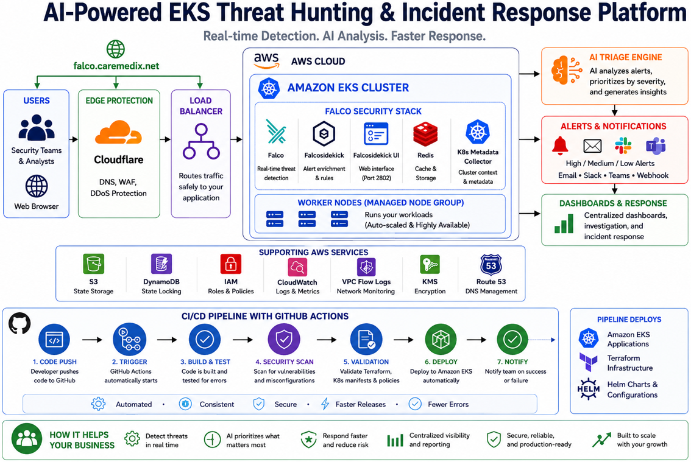

Caption: High-level architecture showing Terraform, AWS, EKS, Falco, Falcosidekick, Cloudflare DNS, and the AI-powered triage workflow.

## Technology Stack

| Category | Technologies |
| -------- | ------------ |
| Cloud | AWS, Amazon EKS, Amazon S3, Amazon DynamoDB, AWS IAM, AWS Load Balancer, AWS Certificate Manager |
| Infrastructure as Code | Terraform |
| Container Orchestration | Kubernetes, kubectl |
| Security Monitoring | Falco, Falcosidekick |
| DNS and Access | Cloudflare DNS, Amazon Route 53, HTTPS |
| Detection Framework | MITRE ATT&CK |
| Automation and Tooling | Helm, Docker, Git, GitHub Actions |
| AI Workflow | OpenAI-assisted alert triage and incident reporting |

## Completed Milestones

- Created Terraform remote backend with S3 and DynamoDB.
- Deployed Amazon EKS cluster.
- Provisioned and validated managed worker nodes.
- Installed Falco and Falcosidekick.
- Exposed Falcosidekick UI through an AWS Load Balancer.
- Configured Cloudflare DNS for `falco.caremedix.net`.
- Validated HTTPS access to the Falcosidekick UI.
- Tested runtime detections successfully.
- Mapped key detections to MITRE ATT&CK techniques.

## Deployment Validation Evidence

### Terraform Backend

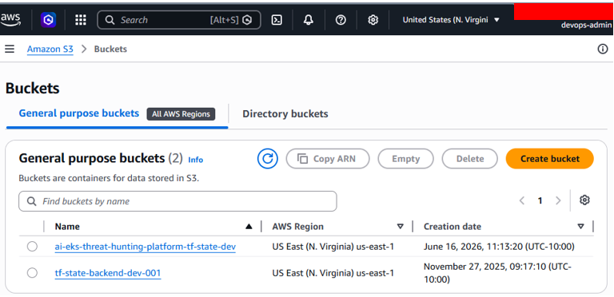

Caption: Amazon S3 bucket created for Terraform remote state storage.

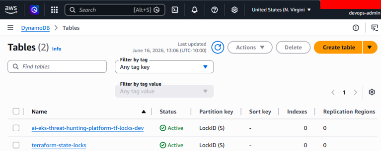

Caption: DynamoDB table created for Terraform state locking.

### Amazon EKS

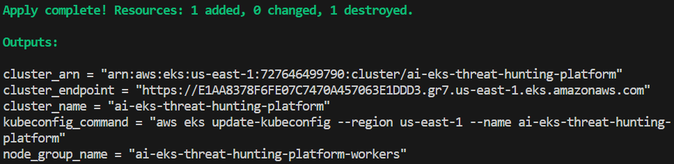

Caption: Terraform completed the EKS infrastructure deployment.

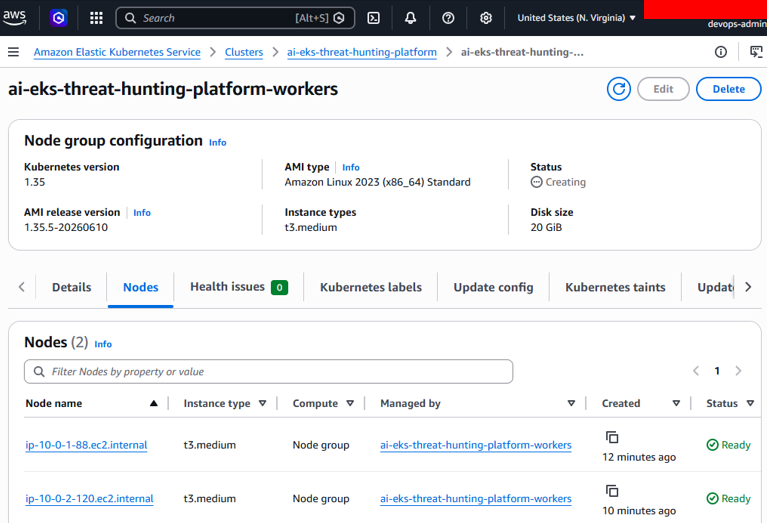

Caption: Amazon EKS managed worker nodes running successfully.

### Domain and HTTPS Access

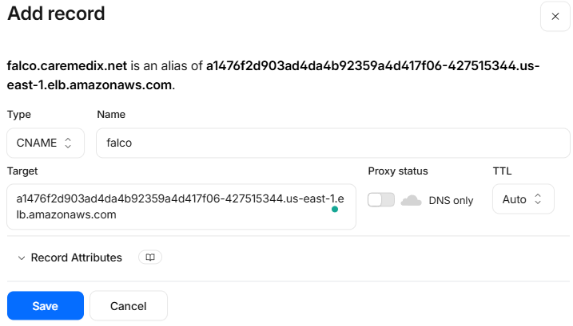

Caption: Cloudflare DNS configured for the Falcosidekick UI hostname.

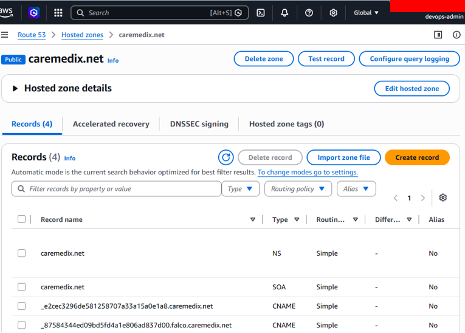

Caption: Route 53 DNS validation supporting domain and certificate configuration.

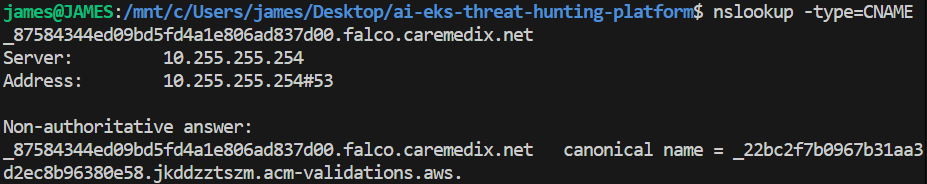

Caption: DNS resolution validated for `falco.caremedix.net`.

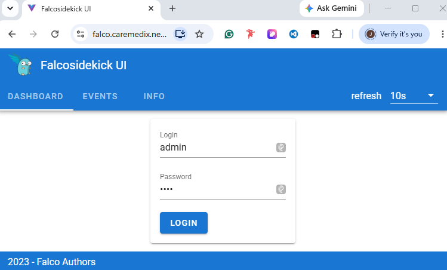

Caption: Falcosidekick UI accessible through the custom domain over HTTPS.

## Runtime Threat Detection Demo

Falco was used to detect suspicious runtime behavior inside Kubernetes workloads. The detections were validated through controlled test activity and mapped to MITRE ATT&CK techniques.

### Detection 1: Terminal Shell in Container

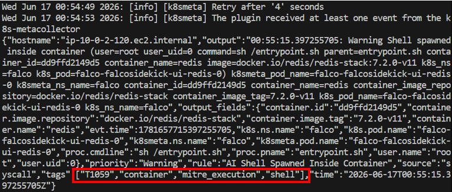

Caption: Test activity triggering terminal shell behavior inside a container.

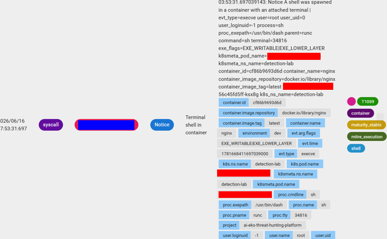

Caption: Falco detected shell activity mapped to MITRE ATT&CK T1059.

### Detection 2: File Write Under `/etc`

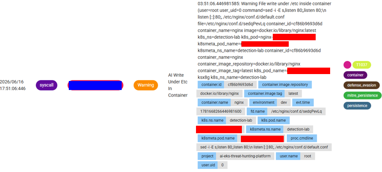

Caption: Falco detected a file write under `/etc`, mapped to MITRE ATT&CK T1037.

## MITRE ATT&CK Mapping

| Technique | Detection | Security Outcome |
| --------- | --------- | ---------------- |
| T1059 | Terminal shell in container | Identifies command execution activity inside a running workload. |
| T1037 | File write under `/etc` inside container | Highlights suspicious system configuration or persistence-related behavior. |

## Security Outcomes

This project demonstrates practical cloud security outcomes:

- Runtime visibility across Kubernetes workloads
- Detection of suspicious container shell activity
- Detection of sensitive system path modification attempts
- Alert review through Falcosidekick UI
- Public dashboard access through controlled DNS and HTTPS configuration
- MITRE ATT&CK-aligned detection documentation
- Repeatable infrastructure and security deployment patterns

## Repository Structure

| Path | Purpose |
| ---- | ------- |
| `terraform/backend` | Terraform remote state backend using S3 and DynamoDB |
| `terraform/eks` | Amazon EKS foundation using an existing AWS VPC |
| `falco/helm` | Falco and Falcosidekick Helm values |
| `falco/rules` | Custom Falco runtime detection rules |
| `scripts` | Operational scripts for installation and detection testing |
| `docs` | Supporting documentation |
| `src` | Project writeups and deployment notes |
| `img` | Portfolio screenshots and validation evidence |

## AI-Powered Alert Triage

The AI triage engine reads Falco-style alerts, identifies the severity, maps the event to MITRE ATT&CK, creates a plain-English summary, recommends response actions, and automatically saves a Markdown incident report.

This phase turns raw runtime security alerts into information that is easier for analysts, engineers, and stakeholders to understand.

Workflow:

```text
Falco Alert
  -> JSON Sample Alert
  -> Python Triage Engine
  -> MITRE ATT&CK Mapping
  -> Recommended Actions
  -> Markdown Incident Report
```

Run all sample alerts:

```bash
python3 ai-triage/triage.py
```

Run one alert:

```bash
python3 ai-triage/triage.py ai-triage/sample-alerts/terminal-shell-t1059.json
```

Generated reports are saved under:

```text
ai-triage/reports/incident-<timestamp>.md
```

Both single-alert and multi-alert report generation were validated.

## Lessons Learned

Key lessons from this project:

- Kubernetes runtime security requires visibility into real workload behavior, not only infrastructure configuration.
- Terraform remote state should be protected with encryption, versioning, and state locking.
- EKS worker node networking must support required outbound access for image pulls and cluster operations.
- Public DNS should point to public load balancer DNS names, not private IP addresses.
- Helm-managed services should be updated through Helm values when possible to reduce configuration drift.
- Detection engineering is stronger when mapped to attacker techniques and response workflows.

## References

| Tool / Service | Purpose | Official Documentation |
| -------------- | ------- | ---------------------- |
| Terraform | Infrastructure as Code | [Terraform Documentation](https://developer.hashicorp.com/terraform/docs) |
| Amazon EKS | Managed Kubernetes service | [Amazon EKS Documentation](https://docs.aws.amazon.com/eks/) |
| Amazon S3 | Remote state storage | [Amazon S3 Documentation](https://docs.aws.amazon.com/s3/) |
| Amazon DynamoDB | Terraform state locking | [Amazon DynamoDB Documentation](https://docs.aws.amazon.com/dynamodb/) |
| AWS IAM | Identity and access management | [AWS IAM Documentation](https://docs.aws.amazon.com/iam/) |
| AWS Load Balancer | Public service exposure | [Elastic Load Balancing Documentation](https://docs.aws.amazon.com/elasticloadbalancing/) |
| AWS Certificate Manager (ACM) | TLS certificate management | [ACM Documentation](https://docs.aws.amazon.com/acm/) |
| Amazon Route 53 | AWS DNS service | [Route 53 Documentation](https://docs.aws.amazon.com/route53/) |
| Cloudflare DNS | Domain DNS management | [Cloudflare DNS Documentation](https://developers.cloudflare.com/dns/) |
| Kubernetes | Container orchestration | [Kubernetes Documentation](https://kubernetes.io/docs/) |
| kubectl | Kubernetes CLI | [kubectl Reference](https://kubernetes.io/docs/reference/kubectl/) |
| Helm | Kubernetes package management | [Helm Documentation](https://helm.sh/docs/) |
| Falco | Runtime threat detection | [Falco Documentation](https://falco.org/docs/) |
| Falcosidekick | Falco alert forwarding and UI | [Falcosidekick Documentation](https://github.com/falcosecurity/falcosidekick) |
| MITRE ATT&CK | Threat technique mapping | [MITRE ATT&CK](https://attack.mitre.org/) |
| GitHub Actions | CI/CD automation | [GitHub Actions Documentation](https://docs.github.com/actions) |
| Docker | Container tooling | [Docker Documentation](https://docs.docker.com/) |
| OpenAI | AI-assisted triage workflows | [OpenAI Documentation](https://platform.openai.com/docs) |
| Git | Version control | [Git Documentation](https://git-scm.com/doc) |

## Acknowledgements

This project was built using open-source technologies and cloud services provided by AWS, Kubernetes, Falco, Cloudflare, HashiCorp, GitHub, MITRE, and OpenAI.

Special thanks to the communities and maintainers who provide documentation, tutorials, and best practices that support continuous learning and innovation.

## Author

James Banday

Cloud Security | Kubernetes | DevSecOps | Threat Detection | Incident Response

LinkedIn:
[https://www.linkedin.com/in/james-allen-morta-banday-62a391128/](https://www.linkedin.com/in/james-allen-morta-banday-62a391128/)

GitHub Repository:
[https://github.com/jbanday808/ai-eks-threat-hunting-platform](https://github.com/jbanday808/ai-eks-threat-hunting-platform)

## Portfolio Summary

This project demonstrates hands-on experience with:

- Amazon Web Services (AWS)
- Terraform
- Infrastructure as Code (IaC)
- Amazon EKS
- Kubernetes Administration
- Runtime Threat Detection
- Falco Security Monitoring
- Incident Response Workflows
- MITRE ATT&CK Mapping
- Cloud Security Operations
- DevSecOps Practices
- Technical Documentation

Simple explanation:

This project showcases how modern cloud environments can be monitored for suspicious activity, helping organizations improve visibility, strengthen security, and respond to threats more effectively.
