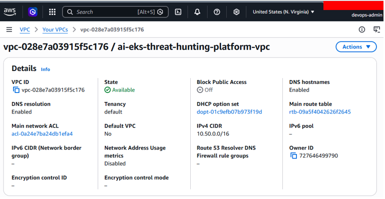

# AI-Powered EKS Threat Hunting & Cloud Incident Response Platform

## Executive Summary

This project demonstrates a completed cloud security and DevSecOps platform for Amazon EKS. It uses GitHub Actions, GitHub OIDC, Terraform, Python, Pytest, CodeQL, Trivy, SBOM generation, Docker, Amazon ECR, Amazon EKS, Falco, AWS Security Agent, GuardDuty Runtime Monitoring, AI threat triage, and cloud incident response reporting.

The platform validates code and infrastructure, builds and scans container images, deploys the AI triage workload to EKS, detects runtime threats, maps alerts to MITRE ATT&CK, and generates incident response reports.

## Architecture Diagrams


Figure 1. High-level view of the platform showing CI/CD, security validation, runtime detection, AI triage, and incident response.


Figure 2. Detailed DevSecOps workflow from GitHub Actions through EKS deployment, GuardDuty monitoring, AI triage, and incident response.

## Architecture Workflow

```text
Git Push
→ GitHub Actions
→ OIDC Authentication
→ Terraform Validation
→ Python Validation
→ Pytest
→ CodeQL
→ Trivy Filesystem Scan
→ SBOM Generation
→ Docker Build
→ Trivy Image Scan
→ Amazon ECR
→ Amazon EKS
→ AWS Security Agent
→ GuardDuty Runtime Monitoring
→ AI Threat Triage
→ Cloud Incident Response
```

## Technology Stack

| Technology | Purpose |
| --- | --- |
| AWS | Cloud platform for the EKS security environment. |
| Amazon EKS | Managed Kubernetes platform for container workloads. |
| Amazon ECR | Container registry for AI triage images. |
| Amazon VPC | Networking foundation for the EKS environment. |
| Amazon S3 | Terraform remote state storage. |
| Amazon DynamoDB | Terraform state locking. |
| AWS IAM | Role and policy management for AWS access. |
| GitHub Actions | CI/CD automation for validation, scanning, image build, and deployment. |
| GitHub OIDC | Short-lived AWS authentication without long-term access keys. |
| Terraform | Infrastructure as Code for AWS resources. |
| Kubernetes | Container orchestration through Amazon EKS. |
| kubectl | Kubernetes resource management. |
| Docker | Container packaging for the AI triage workload. |
| Python | Alert triage and incident report generation. |
| Pytest | Unit testing for the AI triage workflow. |
| CodeQL | Static analysis for Python code. |
| Trivy | Filesystem and image vulnerability scanning. |
| CycloneDX SBOM | Software component inventory format. |
| Falco | Open-source runtime threat detection. |
| AWS GuardDuty Runtime Monitoring | AWS-native runtime threat detection for EKS. |
| AWS Security Agent | GuardDuty runtime visibility on EKS worker nodes. |
| MITRE ATT&CK | Detection mapping to adversary techniques. |

## Completed Milestones

- GitHub Actions CI/CD
- GitHub OIDC Authentication
- Terraform Validation
- Python Validation
- AI Triage Unit Testing
- CodeQL Static Analysis
- Trivy Security Scanning
- SBOM Generation
- Docker Build Pipeline
- Amazon ECR Integration
- Amazon EKS Deployment Pipeline
- AWS Security Agent Validation
- GuardDuty Runtime Monitoring
- Falco Runtime Detection Validation
- AI Incident Report Generation

## Deployment Validation Evidence



Figure 3. Terraform created the VPC networking foundation used by the EKS environment.


Figure 4. Amazon ECR stores the Docker image for the AI triage workload.


Figure 5. GitHub repository variables securely provide AWS and deployment settings to GitHub Actions workflows.


Figure 6. The AWS Security Agent is healthy and supports GuardDuty Runtime Monitoring on EKS worker nodes.


Figure 7. GitHub Actions successfully deployed the AI triage workload to Amazon EKS.


Figure 8. GitHub Actions workflows automate testing, security validation, image builds, and deployments.


Figure 9. A controlled nginx workload was used to test runtime detection behavior.


Figure 10. The runtime test produced expected Kubernetes activity for detection validation.


Figure 11. Falco detected shell activity inside a Kubernetes container and generated a runtime security alert.


Figure 12. Pytest confirmed the AI triage tests passed successfully.


Figure 13. The Python triage workflow generated Markdown incident reports from sample alerts.

## Security Validation Results

Validated Controls:

- GitHub OIDC Authentication
- Infrastructure as Code Validation
- Python Static Validation
- Unit Testing
- CodeQL Static Analysis
- Trivy Filesystem Scanning
- SBOM Generation
- Docker Image Security Scanning
- Runtime Threat Detection
- GuardDuty Runtime Monitoring
- MITRE ATT&CK Mapping
- AI-Assisted Incident Triage

## AI Threat Triage

The AI triage workflow processes Falco-style alerts, extracts Kubernetes context, maps detections to MITRE ATT&CK, recommends response actions, and generates Markdown incident reports.

```bash
python3 -m py_compile ai-triage/triage.py
python3 ai-triage/triage.py
pytest tests -v
```

## Documentation

| Document | Purpose |
| --- | --- |
| [Architecture](docs/architecture.md) | Current architecture, workflow, and validation evidence. |
| [Rebuild AWS Environment](docs/rebuild-aws-environment.md) | Safe end-to-end rebuild guide. |
| [DevSecOps Security Automation](docs/devsecops-security-automation.md) | CI/CD, OIDC, scanning, build, push, and deploy workflow. |
| [Software Supply Chain Security](docs/software-supply-chain-security.md) | SBOM, dependency scanning, image scanning, and deployment trust. |
| [Container Security](docs/container-security.md) | Docker, EKS deployment, Falco, and GuardDuty. |
| [AWS GuardDuty Security Agent](docs/aws-security-agent.md) | GuardDuty agent purpose, validation, and response value. |
| [Cloud Incident Response](docs/cloud-incident-response.md) | Detection, triage, investigation, recommendations, and reports. |

## Repository Structure

| Path | Purpose |
| --- | --- |
| `.github/workflows` | DevSecOps automation workflows. |
| `ai-triage` | Python alert triage and incident report generation. |
| `docs` | Architecture and security documentation. |
| `falco` | Falco Helm values and custom runtime detection rules. |
| `k8s/ai-triage` | Kubernetes deployment manifest for the AI triage workload. |
| `terraform/backend` | Terraform backend resources for state and locking. |
| `terraform/eks` | Amazon EKS and Terraform-managed VPC infrastructure. |
| `tests` | Pytest validation for the AI triage workflow. |

## Required GitHub Repository Variables

```text
AWS_REGION
AWS_ACCOUNT_ID
ECR_REPOSITORY
EKS_CLUSTER_NAME
AWS_ROLE_ARN
```

## Portfolio Summary

This project demonstrates practical implementation of AWS cloud security, Amazon EKS, Kubernetes, Terraform, GitHub Actions, GitHub OIDC, CodeQL, Trivy, SBOM generation, Docker, Amazon ECR, Falco runtime detection, AWS GuardDuty Runtime Monitoring, AI-assisted triage, and cloud incident response.

## References

| Tool / Service | Purpose | Official Documentation |
| ---------------------------- | --------------------------------------------------------------------------- | ----------------------------------------------------------------------------------------------------------------------------------- |
| AWS | Cloud platform used to host the project resources. | https://docs.aws.amazon.com/ |
| Amazon EKS | Managed Kubernetes service used to run container workloads. | https://docs.aws.amazon.com/eks/ |
| Amazon ECR | Container registry used to store Docker images. | https://docs.aws.amazon.com/ecr/ |
| AWS IAM | Identity and access management for roles, policies, and OIDC access. | https://docs.aws.amazon.com/iam/ |
| GitHub OIDC with AWS | Secure authentication from GitHub Actions to AWS without long-term keys. | https://docs.github.com/en/actions/deployment/security-hardening-your-deployments/configuring-openid-connect-in-amazon-web-services |
| GitHub Actions | CI/CD automation for validation, scanning, image build, and EKS deployment. | https://docs.github.com/en/actions |
| Terraform | Infrastructure as Code tool used to provision AWS resources. | https://developer.hashicorp.com/terraform/docs |
| Kubernetes | Container orchestration platform used by Amazon EKS. | https://kubernetes.io/docs/ |
| kubectl | Command-line tool used to manage Kubernetes resources. | https://kubernetes.io/docs/reference/kubectl/ |
| Docker | Container tooling used to package the AI triage workload. | https://docs.docker.com/ |
| Python | Programming language used for AI triage and incident report generation. | https://docs.python.org/3/ |
| Pytest | Testing framework used to validate the AI triage workflow. | https://docs.pytest.org/ |
| CodeQL | Static analysis tool used to scan code for security issues. | https://codeql.github.com/docs/ |
| Trivy | Security scanner used for filesystem and container image scanning. | https://aquasecurity.github.io/trivy/ |
| CycloneDX SBOM | SBOM format used to document software components. | https://cyclonedx.org/docs/ |
| Falco | Runtime security tool used to detect suspicious container behavior. | https://falco.org/docs/ |
| AWS GuardDuty | AWS-native threat detection service used for runtime monitoring. | https://docs.aws.amazon.com/guardduty/ |
| GuardDuty Runtime Monitoring | Runtime monitoring feature used to observe EKS workload behavior. | https://docs.aws.amazon.com/guardduty/latest/ug/runtime-monitoring.html |
| AWS Security Agent for EKS | Security agent used by GuardDuty Runtime Monitoring for EKS workloads. | https://docs.aws.amazon.com/guardduty/latest/ug/eks-runtime-monitoring.html |
| Amazon VPC | Networking foundation used by the EKS environment. | https://docs.aws.amazon.com/vpc/ |
| Amazon S3 | Storage service used for Terraform remote state. | https://docs.aws.amazon.com/s3/ |
| Amazon DynamoDB | Database service used for Terraform state locking. | https://docs.aws.amazon.com/dynamodb/ |
| MITRE ATT&CK | Framework used to map detections to adversary techniques. | https://attack.mitre.org/ |

## Author

James Banday

Cloud Security | Kubernetes | DevSecOps | Threat Detection | Incident Response

GitHub: https://github.com/jbanday808/ai-eks-threat-hunting-platform/tree/main

LinkedIn: https://www.linkedin.com/in/james-allen-morta-banday-62a391128/
