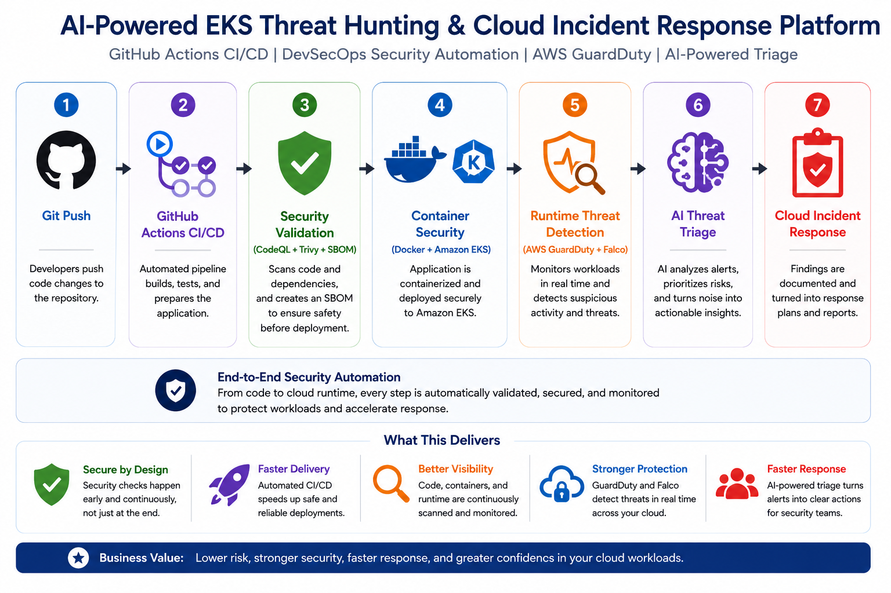
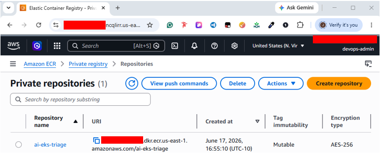
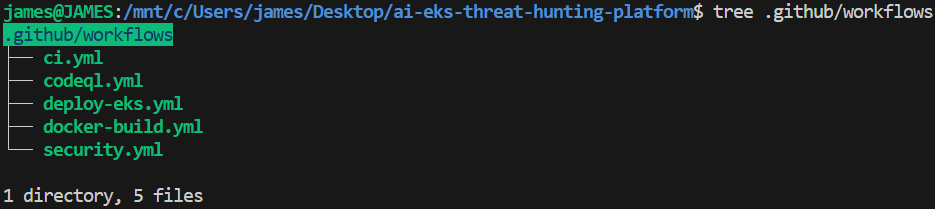
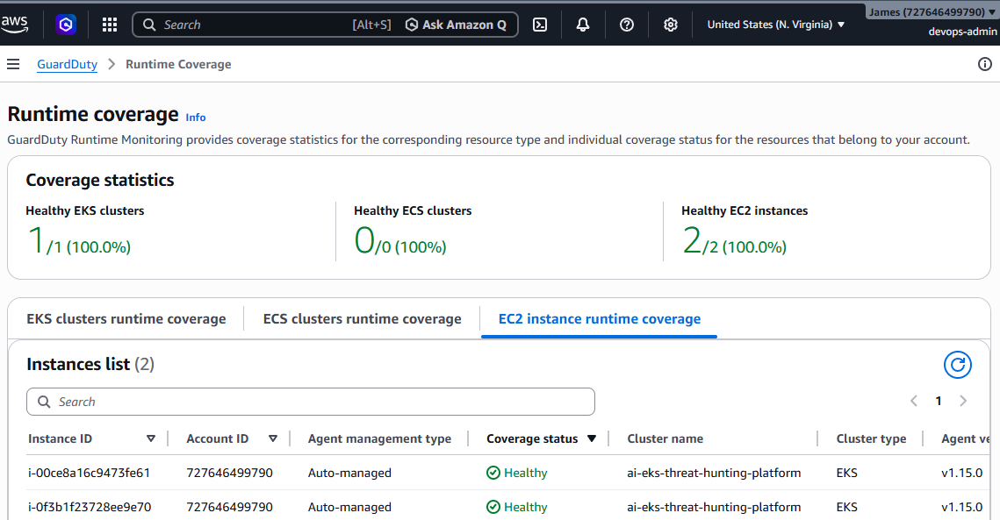
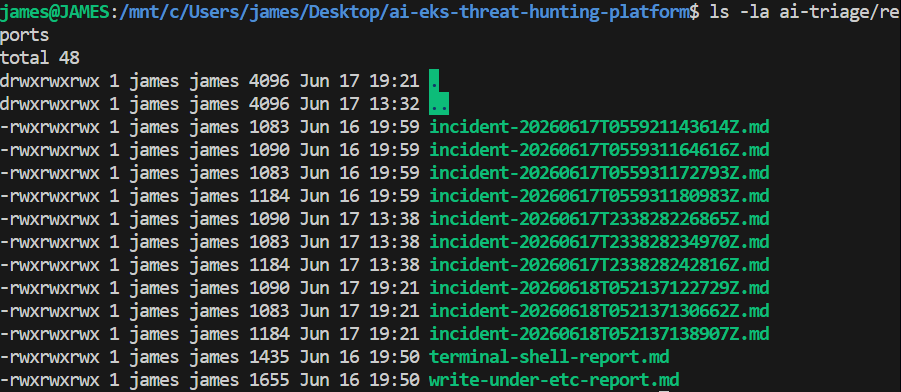

# AI-Powered EKS Threat Hunting & Cloud Incident Response Platform

This project demonstrates a completed DevSecOps and runtime security workflow for Amazon EKS. It combines GitHub Actions, GitHub OIDC, Terraform validation, Python testing, CodeQL, Trivy, SBOM generation, Docker, Amazon ECR, Amazon EKS, Falco, AWS Security Agent, GuardDuty Runtime Monitoring, AI threat triage, and cloud incident response reporting.

## Architecture Diagrams

### High-Level Architecture



Figure 1. High-level view of the AI-Powered EKS Threat Hunting & Cloud Incident Response Platform showing GitHub Actions CI/CD, security validation, container security, runtime threat detection, AI triage, and cloud incident response.

### Detailed DevSecOps Architecture


Figure 2. End-to-end DevSecOps workflow including GitHub Actions, OIDC authentication, Terraform validation, Python testing, CodeQL, Trivy, SBOM generation, Docker image build, Amazon ECR, Amazon EKS deployment, AWS Security Agent, GuardDuty runtime monitoring, AI triage, and incident response.

## Architecture Workflow

```text
Git Push
→ GitHub Actions
→ OIDC Authentication
→ Terraform Validation
→ Python Validation
→ Pytest
→ CodeQL
→ Trivy Filesystem Scan
→ SBOM Generation
→ Docker Build
→ Trivy Image Scan
→ Amazon ECR
→ Amazon EKS
→ AWS Security Agent
→ GuardDuty Runtime Monitoring
→ AI Threat Triage
→ Cloud Incident Response
```

## Technology Stack

| Technology | Purpose |
| --- | --- |
| Terraform | Builds the EKS foundation and supporting AWS infrastructure. |
| GitHub Actions | Automates CI/CD, validation, scanning, image build, and deployment. |
| GitHub OIDC | Provides short-lived AWS authentication without long-term access keys. |
| Pytest | Validates AI triage behavior with unit tests. |
| CodeQL | Performs static analysis for Python code. |
| Trivy | Scans the filesystem and container images for vulnerabilities. |
| SBOM | Documents software components in CycloneDX format. |
| Docker | Packages the AI triage workload as a container image. |
| Amazon ECR | Stores validated container images. |
| Amazon EKS | Runs Kubernetes workloads and runtime security tooling. |
| Falco | Provides open-source runtime threat detection. |
| AWS Security Agent | Supports AWS-native runtime visibility on EKS worker nodes. |
| AWS GuardDuty Runtime Monitoring | Produces AWS-native runtime security findings. |
| Python | Powers AI-assisted alert triage and incident report generation. |
| MITRE ATT&CK | Maps detections to known adversary techniques. |

## Completed Milestones

- GitHub Actions CI/CD
- GitHub OIDC Authentication
- CodeQL Static Analysis
- Trivy Security Scanning
- SBOM Generation
- Docker Build Pipeline
- Amazon ECR Integration
- Amazon EKS Deployment Pipeline
- GuardDuty Runtime Monitoring
- AWS Security Agent
- Falco Runtime Detection Validation
- AI Triage Unit Testing

## Deployment Validation Evidence

### EKS Cluster Deployment


Terraform successfully deployed the Amazon EKS cluster and worker nodes.

### Amazon ECR Repository



Amazon ECR repository used for storing container images.

### GitHub Actions Workflows



CI/CD workflows automate testing, security validation, image builds, and deployments.

### GitHub OIDC Configuration


GitHub Actions uses OIDC federation and temporary credentials instead of long-lived AWS access keys.

### GuardDuty Runtime Monitoring



AWS Security Agent and GuardDuty Runtime Monitoring are enabled and healthy on EKS worker nodes.

### Falco Runtime Detection Test


Falco successfully detected shell activity inside a Kubernetes container and generated runtime security alerts.

### AI Triage Validation




Python unit tests passed successfully and incident reports were automatically generated.

## Security Validation Results

Validated Controls:

- GitHub OIDC Authentication
- Infrastructure as Code Validation
- Python Static Validation
- Unit Testing
- CodeQL Static Analysis
- Trivy Filesystem Scanning
- SBOM Generation
- Docker Image Security Scanning
- Runtime Threat Detection
- GuardDuty Runtime Monitoring
- MITRE ATT&CK Mapping
- AI-Assisted Incident Triage

## AI Threat Triage

The Python triage workflow processes Falco-style alerts, extracts Kubernetes context, maps detections to MITRE ATT&CK, recommends response actions, and generates Markdown incident reports.

```bash
python3 -m py_compile ai-triage/triage.py
python3 ai-triage/triage.py
pytest tests -v
```

## Documentation

| Document | Purpose |
| --- | --- |
| [Architecture](docs/architecture.md) | Current architecture, workflow, and validation evidence. |
| [Rebuild AWS Environment](docs/rebuild-aws-environment.md) | Safe end-to-end rebuild guide. |
| [DevSecOps Security Automation](docs/devsecops-security-automation.md) | CI/CD, OIDC, scanning, build, push, and deploy workflow. |
| [Software Supply Chain Security](docs/software-supply-chain-security.md) | SBOM, dependency scanning, image scanning, and deployment trust. |
| [Container Security](docs/container-security.md) | Docker, EKS deployment, Falco, and GuardDuty. |
| [AWS GuardDuty Security Agent](docs/aws-security-agent.md) | GuardDuty agent purpose, validation, and response value. |
| [Cloud Incident Response](docs/cloud-incident-response.md) | Detection, triage, investigation, recommendations, and reports. |

## Repository Structure

| Path | Purpose |
| --- | --- |
| `.github/workflows` | DevSecOps automation workflows. |
| `ai-triage` | Python alert triage and incident report generation. |
| `docs` | Architecture and security documentation. |
| `falco` | Falco Helm values and custom runtime detection rules. |
| `k8s/ai-triage` | Kubernetes deployment manifest for the AI triage workload. |
| `terraform/backend` | Terraform backend resources for state and locking. |
| `terraform/eks` | Amazon EKS and Terraform-managed VPC infrastructure. |
| `tests` | Pytest validation for the AI triage workflow. |

## Required GitHub Repository Variables

```text
AWS_REGION
AWS_ACCOUNT_ID
ECR_REPOSITORY
EKS_CLUSTER_NAME
AWS_ROLE_ARN
```

## Portfolio Summary

This project demonstrates practical implementation of AWS cloud security, Amazon EKS, Kubernetes, Terraform, GitHub Actions, GitHub OIDC, CodeQL, Trivy, SBOM generation, Docker, Amazon ECR, Falco runtime detection, AWS GuardDuty Runtime Monitoring, AI-assisted triage, and cloud incident response.

## References

| Tool / Service | Purpose | Official Documentation |
| --- | --- | --- |
| AWS | Cloud platform used to host the project resources. | https://docs.aws.amazon.com/ |
| Amazon EKS | Managed Kubernetes service used to run container workloads. | https://docs.aws.amazon.com/eks/ |
| Amazon ECR | Container registry used to store Docker images. | https://docs.aws.amazon.com/ecr/ |
| AWS IAM | Identity and access management for roles, policies, and OIDC access. | https://docs.aws.amazon.com/iam/ |
| GitHub OIDC with AWS | Secure authentication from GitHub Actions to AWS without long-term keys. | https://docs.github.com/en/actions/deployment/security-hardening-your-deployments/configuring-openid-connect-in-amazon-web-services |
| GitHub Actions | CI/CD automation for validation, scanning, image build, and EKS deployment. | https://docs.github.com/en/actions |
| Terraform | Infrastructure as Code tool used to provision AWS resources. | https://developer.hashicorp.com/terraform/docs |
| Kubernetes | Container orchestration platform used by Amazon EKS. | https://kubernetes.io/docs/ |
| kubectl | Command-line tool used to manage Kubernetes resources. | https://kubernetes.io/docs/reference/kubectl/ |
| Docker | Container tooling used to package the AI triage workload. | https://docs.docker.com/ |
| Python | Programming language used for AI triage and incident report generation. | https://docs.python.org/3/ |
| Pytest | Testing framework used to validate the AI triage workflow. | https://docs.pytest.org/ |
| CodeQL | Static analysis tool used to scan code for security issues. | https://codeql.github.com/docs/ |
| Trivy | Security scanner used for filesystem and container image scanning. | https://aquasecurity.github.io/trivy/ |
| CycloneDX SBOM | SBOM format used to document software components. | https://cyclonedx.org/docs/ |
| Falco | Runtime security tool used to detect suspicious container behavior. | https://falco.org/docs/ |
| AWS GuardDuty | AWS-native threat detection service used for runtime monitoring. | https://docs.aws.amazon.com/guardduty/ |
| GuardDuty Runtime Monitoring | Runtime monitoring feature used to observe EKS workload behavior. | https://docs.aws.amazon.com/guardduty/latest/ug/runtime-monitoring.html |
| AWS Security Agent for EKS | Security agent used by GuardDuty Runtime Monitoring for EKS workloads. | https://docs.aws.amazon.com/guardduty/latest/ug/eks-runtime-monitoring.html |
| Amazon VPC | Networking foundation used by the EKS environment. | https://docs.aws.amazon.com/vpc/ |
| Amazon S3 | Storage service used for Terraform remote state. | https://docs.aws.amazon.com/s3/ |
| Amazon DynamoDB | Database service used for Terraform state locking. | https://docs.aws.amazon.com/dynamodb/ |
| MITRE ATT&CK | Framework used to map detections to adversary techniques. | https://attack.mitre.org/ |

## Author

James Banday

Cloud Security | Kubernetes | DevSecOps | Threat Detection | Incident Response

GitHub: https://github.com/jbanday808/ai-eks-threat-hunting-platform/tree/main

LinkedIn: https://www.linkedin.com/in/james-allen-morta-banday-62a391128/
