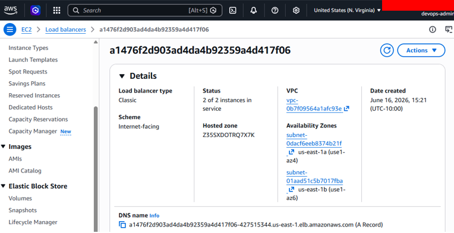
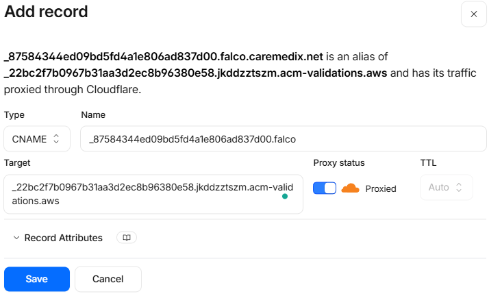

# AI-Powered EKS Threat Hunting & Incident Response Platform

## Executive Summary

This project demonstrates a cloud-native security monitoring platform built on Amazon EKS. It uses Terraform, Kubernetes, Falco, Falcosidekick, Cloudflare, and AI-assisted triage to detect suspicious container activity, map detections to MITRE ATT&CK, and generate incident response reports.

The platform was built to show how security teams can improve Kubernetes visibility, validate runtime detections, and respond faster when suspicious activity appears inside containerized workloads.

## Project Overview

This project validates the full lifecycle of a cloud security monitoring platform:

- Infrastructure provisioning with Terraform
- Kubernetes deployment on Amazon EKS
- Runtime security monitoring with Falco
- Alert visibility through Falcosidekick
- DNS and HTTPS access validation
- Threat detection testing in running workloads
- MITRE ATT&CK mapping for validated detections
- AI-powered alert triage
- Automated Markdown incident reporting

## Business Value

This platform helps organizations improve Kubernetes security visibility and detect suspicious container activity faster. By combining runtime monitoring, alert review, MITRE ATT&CK mapping, and AI-assisted reporting, it reduces investigation time and supports faster incident response.

The project also demonstrates repeatable cloud security deployment patterns. This makes it easier for teams to build, validate, and document security monitoring capabilities across cloud environments.

## Architecture Overview

The architecture combines AWS infrastructure, Amazon EKS, Kubernetes runtime monitoring, Falco detections, Falcosidekick alert visibility, Cloudflare DNS, and AI-assisted incident response.


Caption: End-to-end architecture showing AWS, Amazon EKS, Falco runtime security, Falcosidekick, Cloudflare, AI-powered alert triage, automated incident reporting, and future CI/CD integration.

## Architecture Workflow

```text
User Activity
  -> Amazon EKS
  -> Falco Runtime Detection
  -> Falcosidekick
  -> Dashboard Visibility
  -> AI Triage
  -> Incident Response
```

## Technology Stack

| Technology | Purpose | Business Benefit |
| ---------- | ------- | ---------------- |
| AWS | Cloud infrastructure platform | Provides scalable cloud services for the security platform |
| Amazon EKS | Managed Kubernetes service | Reduces operational overhead for Kubernetes workloads |
| Kubernetes | Container orchestration | Runs and manages containerized applications |
| Terraform | Infrastructure as Code | Enables repeatable infrastructure deployment |
| Amazon S3 | Terraform remote state storage | Centralizes infrastructure state management |
| Amazon DynamoDB | Terraform state locking | Prevents conflicting infrastructure updates |
| AWS IAM | Access control | Supports least-privilege cloud permissions |
| AWS Load Balancer | External service access | Exposes the Falcosidekick UI through managed AWS networking |
| AWS Certificate Manager | TLS certificate management | Supports encrypted HTTPS access |
| Amazon Route 53 | DNS and validation records | Supports certificate validation and DNS workflows |
| Cloudflare DNS | Public DNS management | Routes user traffic to the security dashboard |
| Falco | Runtime threat detection | Detects suspicious container behavior in real time |
| Falcosidekick | Alert forwarding and UI | Makes Falco alerts easier to review |
| Redis | Falcosidekick UI data support | Supports alert visibility and dashboard operations |
| Kubernetes Metadata Collector | Workload context enrichment | Adds Kubernetes context to security events |
| CloudWatch | AWS monitoring and logs | Improves operational visibility |
| VPC Flow Logs | Network flow visibility | Supports cloud network investigation |
| KMS | Key management | Supports encryption and data protection |
| Helm | Kubernetes package deployment | Simplifies application installation and updates |
| Docker | Container tooling | Supports containerized workload testing |
| Python | Alert triage automation | Converts alert data into incident reports |
| GitHub Actions | Future CI/CD automation | Supports repeatable validation and deployment workflows |
| MITRE ATT&CK | Threat mapping framework | Connects detections to known adversary techniques |

## Completed Milestones

- [x] Terraform remote backend using S3 and DynamoDB
- [x] Amazon EKS cluster deployed
- [x] Managed worker nodes validated
- [x] Falco runtime security installed
- [x] Falcosidekick UI deployed
- [x] AWS Load Balancer configured
- [x] Cloudflare DNS configured
- [x] Route 53 validation completed
- [x] HTTPS access validated
- [x] Runtime detection testing completed
- [x] MITRE ATT&CK mapping completed
- [x] AI triage engine created
- [x] Automated Markdown incident reports generated
- [x] GitHub repository cleaned and synchronized

## Deployment Validation Evidence

### Terraform Backend


Caption: Amazon S3 bucket used for Terraform remote state storage.


Caption: DynamoDB table used for Terraform state locking to prevent conflicting infrastructure updates.

### Amazon EKS Deployment


Caption: Terraform deployment completed successfully for the Amazon EKS infrastructure.


Caption: Amazon EKS managed worker nodes joined the cluster and are running successfully.

### AWS Load Balancer



Caption: AWS Load Balancer exposing the Falcosidekick UI for external access.

### DNS and HTTPS Validation


Caption: Cloudflare DNS record configured to route traffic to the AWS Load Balancer.


Caption: Route 53 validation records supporting certificate validation.



Caption: Cloudflare CNAME record used for AWS certificate validation.


Caption: DNS lookup confirming that the validation record resolves correctly.


Caption: Falcosidekick UI accessible through HTTPS using the custom domain.

## Runtime Threat Detection Demonstration

Falco was used to detect suspicious runtime behavior inside Kubernetes workloads. The detections were generated through controlled testing and mapped to MITRE ATT&CK techniques.

### Detection 1: Terminal Shell in Container

MITRE ATT&CK: T1059 - Command and Scripting Interpreter


Caption: Falco log output showing shell activity mapped to MITRE ATT&CK T1059.


Caption: Falcosidekick UI showing the Terminal Shell in Container detection mapped to T1059.

Simple Explanation: A command shell was launched inside a running container. Falco detected the activity, mapped it to MITRE ATT&CK T1059, and generated a security alert.

### Detection 2: File Write Under `/etc`

MITRE ATT&CK: T1037 - Boot or Logon Initialization Scripts


Caption: Falcosidekick UI showing a file write under `/etc` mapped to MITRE ATT&CK T1037.

Simple Explanation: A file modification occurred within the `/etc` directory of a container. Falco detected the activity and generated a security alert.

## MITRE ATT&CK Mapping

| Technique | Description | Detection | Security Value |
| --------- | ----------- | --------- | -------------- |
| T1059 | Command and Scripting Interpreter | Terminal Shell in Container | Detects command execution inside a running workload |
| T1037 | Boot or Logon Initialization Scripts | File Write Under `/etc` | Detects suspicious system configuration or persistence-related behavior |

## Security Outcomes

This project demonstrates practical cloud security outcomes:

- Kubernetes runtime visibility
- Detection of suspicious shell activity
- Detection of file modification under sensitive paths
- Alert review through Falcosidekick UI
- DNS and HTTPS validation for dashboard access
- MITRE ATT&CK-aligned detection documentation
- AI-assisted incident response workflow

## Repository Structure

| Path | Purpose |
| ---- | ------- |
| `terraform/backend` | Terraform remote state backend using S3 and DynamoDB |
| `terraform/eks` | Amazon EKS infrastructure deployment |
| `falco/helm` | Falco and Falcosidekick Helm values |
| `falco/rules` | Custom Falco runtime detection rules |
| `ai-triage` | Python-based alert triage engine |
| `ai-triage/sample-alerts` | Sample Falco-style alerts for testing |
| `ai-triage/reports` | Generated Markdown incident reports |
| `scripts` | Operational scripts for setup and testing |
| `docs` | Supporting documentation |
| `src` | Project writeups and deployment notes |
| `img` | Portfolio screenshots and validation evidence |
| `.github/workflows` | Future CI/CD automation workflows |

## AI-Powered Alert Triage

The AI triage engine reads Falco-style alerts, identifies severity, maps the event to MITRE ATT&CK, creates a plain-English summary, recommends response actions, and automatically saves a Markdown incident report.

This workflow helps analysts and engineers move from raw alert data to clear response guidance faster. It also creates documentation that can be shared with technical and non-technical stakeholders.

Workflow:

```text
Falco Alert
  -> JSON Sample Alert
  -> Python Triage Engine
  -> MITRE ATT&CK Mapping
  -> Recommended Actions
  -> Markdown Incident Report
```

Run all sample alerts:

```bash
python3 ai-triage/triage.py
```

Run one alert:

```bash
python3 ai-triage/triage.py ai-triage/sample-alerts/terminal-shell-t1059.json
```

Generated reports:

```text
ai-triage/reports/incident-<timestamp>.md
```

Both single-alert and multi-alert report generation were validated.

## Lessons Learned

- Kubernetes runtime security requires real workload visibility.
- Terraform remote state should be protected with encryption, versioning, and state locking.
- EKS worker node networking must support required cluster operations.
- Public DNS should point to public load balancer DNS names.
- Helm-managed services should be updated carefully to avoid drift.
- Detection engineering is stronger when mapped to MITRE ATT&CK.
- AI-assisted triage helps convert raw alerts into actionable incident reports.

## Future Enhancements Roadmap

- AI-Powered Alert Triage
- Automated Incident Reports
- Slack notifications
- Microsoft Teams notifications
- Security dashboards
- Threat Intelligence Enrichment
- GitHub Actions CI/CD
- Automated Security Testing

## References

| Tool / Service | Purpose | Official Documentation |
| -------------- | ------- | ---------------------- |
| Terraform | Infrastructure as Code | [Terraform Documentation](https://developer.hashicorp.com/terraform/docs) |
| AWS | Cloud services platform | [AWS Documentation](https://docs.aws.amazon.com/) |
| Amazon EKS | Managed Kubernetes service | [Amazon EKS Documentation](https://docs.aws.amazon.com/eks/) |
| Amazon S3 | Remote state storage | [Amazon S3 Documentation](https://docs.aws.amazon.com/s3/) |
| Amazon DynamoDB | Terraform state locking | [Amazon DynamoDB Documentation](https://docs.aws.amazon.com/dynamodb/) |
| AWS IAM | Identity and access management | [AWS IAM Documentation](https://docs.aws.amazon.com/iam/) |
| AWS Load Balancer | Public service exposure | [Elastic Load Balancing Documentation](https://docs.aws.amazon.com/elasticloadbalancing/) |
| AWS Certificate Manager | TLS certificate management | [ACM Documentation](https://docs.aws.amazon.com/acm/) |
| Amazon Route 53 | AWS DNS service | [Route 53 Documentation](https://docs.aws.amazon.com/route53/) |
| Cloudflare DNS | Domain DNS management | [Cloudflare DNS Documentation](https://developers.cloudflare.com/dns/) |
| Kubernetes | Container orchestration | [Kubernetes Documentation](https://kubernetes.io/docs/) |
| kubectl | Kubernetes CLI | [kubectl Reference](https://kubernetes.io/docs/reference/kubectl/) |
| Helm | Kubernetes package management | [Helm Documentation](https://helm.sh/docs/) |
| Falco | Runtime threat detection | [Falco Documentation](https://falco.org/docs/) |
| Falcosidekick | Falco alert forwarding and UI | [Falcosidekick Documentation](https://github.com/falcosecurity/falcosidekick) |
| Redis | Data store used by Falcosidekick UI | [Redis Documentation](https://redis.io/docs/latest/) |
| CloudWatch | AWS monitoring and logging | [CloudWatch Documentation](https://docs.aws.amazon.com/cloudwatch/) |
| VPC Flow Logs | Network traffic visibility | [VPC Flow Logs Documentation](https://docs.aws.amazon.com/vpc/latest/userguide/flow-logs.html) |
| AWS KMS | Key management and encryption | [AWS KMS Documentation](https://docs.aws.amazon.com/kms/) |
| MITRE ATT&CK | Threat technique mapping | [MITRE ATT&CK](https://attack.mitre.org/) |
| GitHub Actions | CI/CD automation | [GitHub Actions Documentation](https://docs.github.com/actions) |
| Docker | Container tooling | [Docker Documentation](https://docs.docker.com/) |
| Python | Automation and scripting | [Python Documentation](https://docs.python.org/3/) |
| OpenAI | AI-assisted triage workflows | [OpenAI Documentation](https://platform.openai.com/docs) |
| Git | Version control | [Git Documentation](https://git-scm.com/doc) |

## Acknowledgements

This project was built using open-source technologies and cloud services from AWS, Kubernetes, Falco, Cloudflare, HashiCorp, GitHub, MITRE, and OpenAI.

Thank you to the maintainers and communities who provide documentation, tooling, and best practices that support cloud security engineering and continuous learning.

## Author

James Banday

Cloud Security | Kubernetes | DevSecOps | Threat Detection | Incident Response

LinkedIn:
[https://www.linkedin.com/in/james-allen-morta-banday-62a391128/](https://www.linkedin.com/in/james-allen-morta-banday-62a391128/)

GitHub:
[https://github.com/jbanday808/ai-eks-threat-hunting-platform](https://github.com/jbanday808/ai-eks-threat-hunting-platform)

## Portfolio Summary

This project demonstrates hands-on experience with AWS, Terraform, Amazon EKS, Kubernetes, Falco, threat detection, incident response, MITRE ATT&CK, DevSecOps, and cloud security.

Simple Explanation: This project shows how cloud environments can be monitored for suspicious activity, helping organizations improve visibility, strengthen security, and respond to threats faster.

## Skills Demonstrated

- AWS Cloud Security
- Amazon EKS
- Kubernetes Administration
- Terraform
- Infrastructure as Code
- Runtime Threat Detection
- Falco Security Monitoring
- Falcosidekick Alert Visibility
- MITRE ATT&CK Framework
- Incident Response
- Python Automation
- DevSecOps
- Cloud Operations
- Technical Documentation
