# Screenshot Evidence

## LummaStealer_01_MalwareBazaar_Sample_Details.png

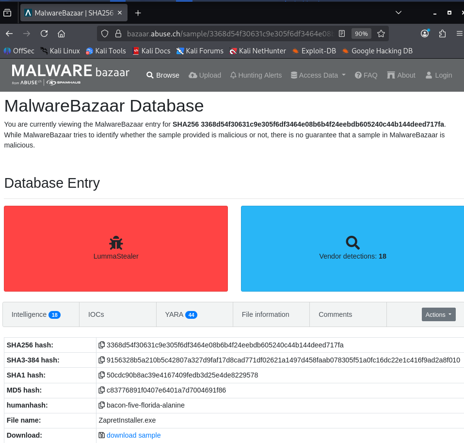

Explanation:

Shows the MalwareBazaar entry for the Lumma Stealer sample, including its hash, malware family, and vendor detections.

## LummaStealer_02_Noriben_Dynamic_Analysis_Results.png

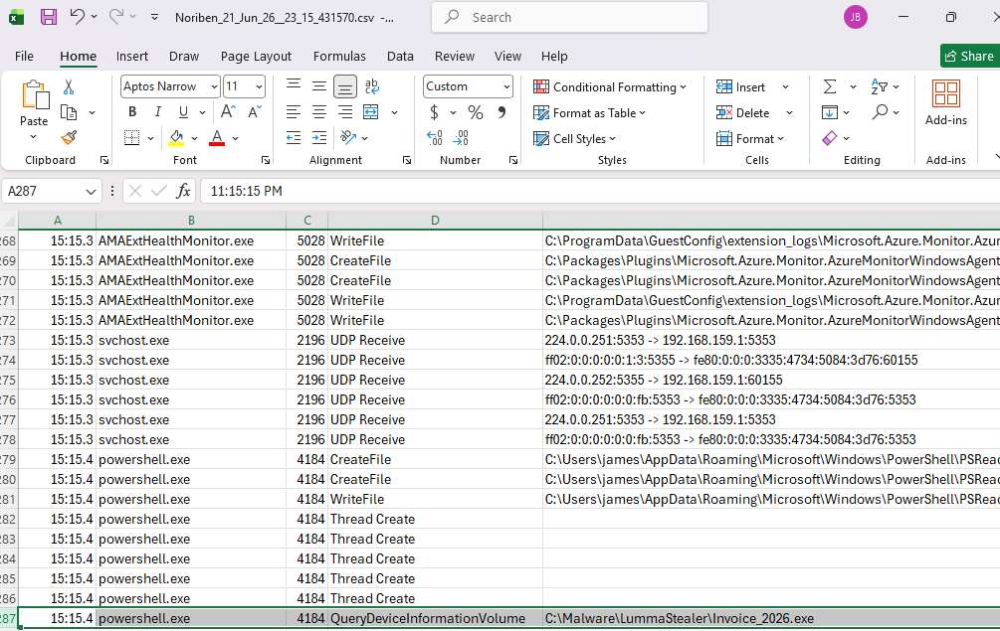

Explanation:

Shows activity captured during malware execution, including process, file, and network-related behavior.

## LummaStealer_03_IDA_Imports.png

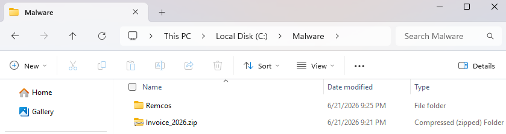

Explanation:

Shows the imported functions and libraries reviewed during reverse engineering.

## LummaStealer_04_IDA_PE_Overview.png

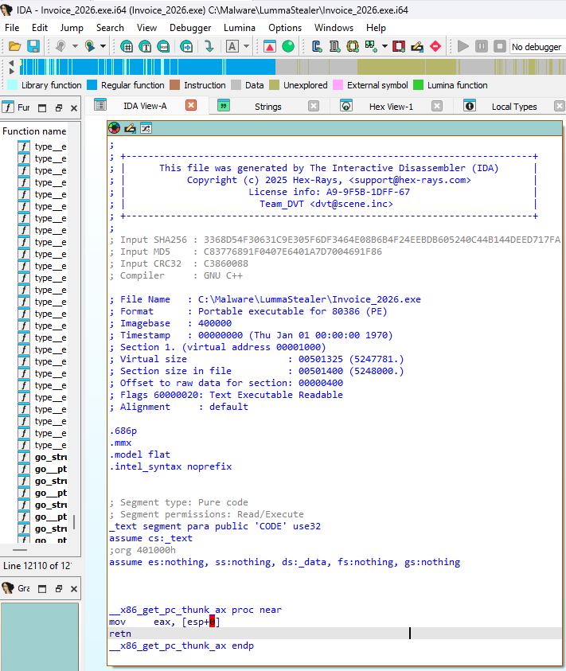

Explanation:

Shows the file overview in IDA Pro, confirming the sample is a Windows executable.

## LummaStealer_05_IDA_Credential_Theft_Indicators.png

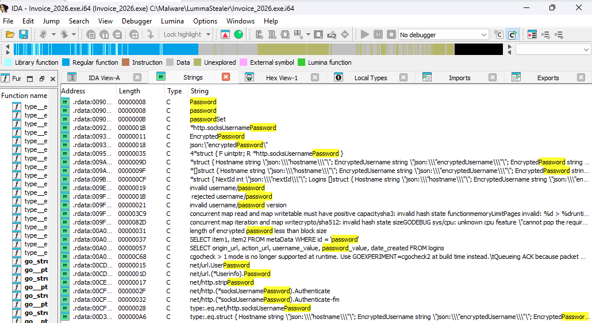

Explanation:

Shows password-related strings that suggest the malware is designed to steal credentials.

## LummaStealer_06_IDA_Credential_Collection_Functions.png

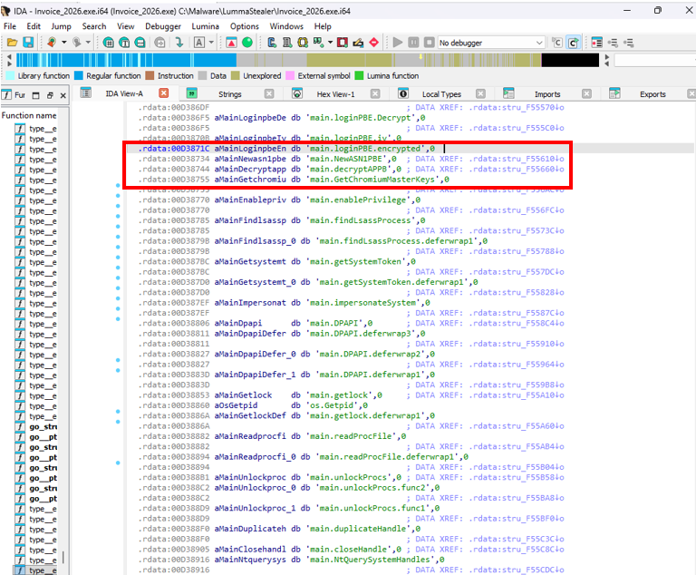

Explanation:

Shows functions related to collecting and decrypting protected browser password data.

## LummaStealer_07_IDA_Privilege_Escalation_and_Credential_Theft_Functions.png

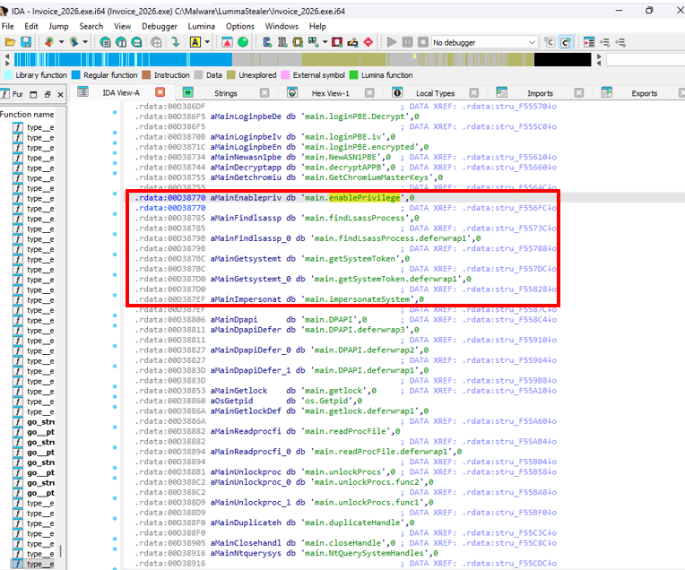

Explanation:

Shows functions related to privilege access, process discovery, and credential theft behavior.

## LummaStealer_08_IDA_ChromiumMasterKeys_Function_Reference.png

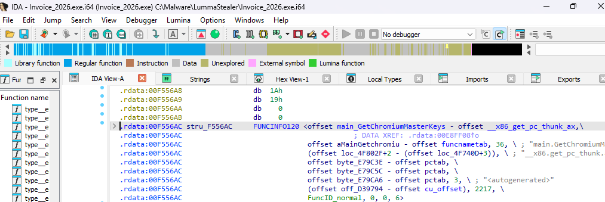

Explanation:

Shows a function related to Chromium browser master keys, which are used to protect saved browser passwords.

## LummaStealer_09_Defender_Threat_Classification.png

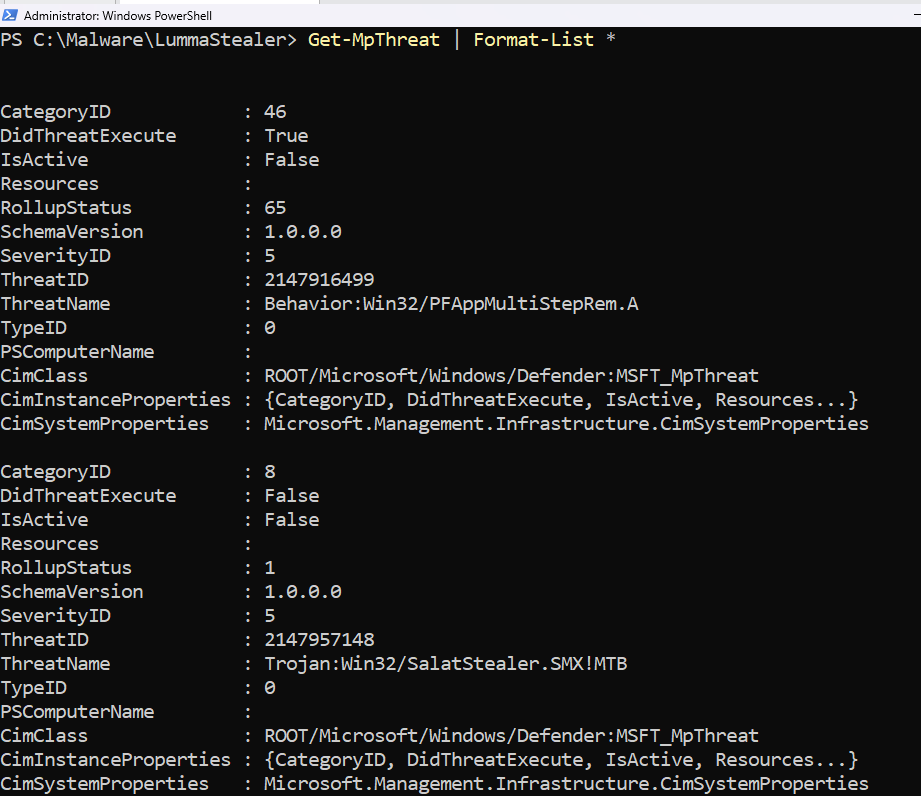

Explanation:

Shows Microsoft Defender identifying the malware as SalatStealer/Lumma Stealer.

## LummaStealer_10_ProcessMonitor_Execution_Activity.png

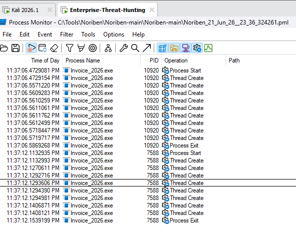

Explanation:

Shows Process Monitor confirming that the malware process started, created threads, and exited.

## LummaStealer_11_Defender_Threat_Blocked.png

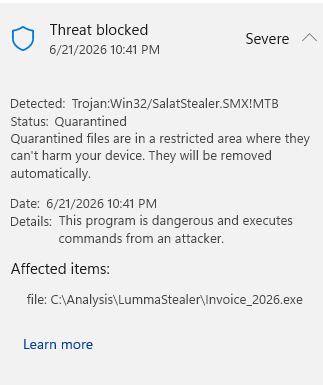

Explanation:

Shows Microsoft Defender blocking and quarantining the malware before it could continue running.

## LummaStealer_12_Defender_Threat_Removed.png

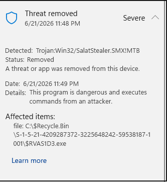

Explanation:

Shows Microsoft Defender removing the malware from the system after quarantine.

## LummaStealer_13_YARA_Detection_Validation.png

Explanation:

This screenshot will show that the custom YARA rule successfully detected the Lumma Stealer sample based on known credential theft strings.

Status: Pending. The malware sample and YARA command-line tool are not present in this workspace, so a genuine validation screenshot could not be captured.

## Supplemental Infection Chain Diagram

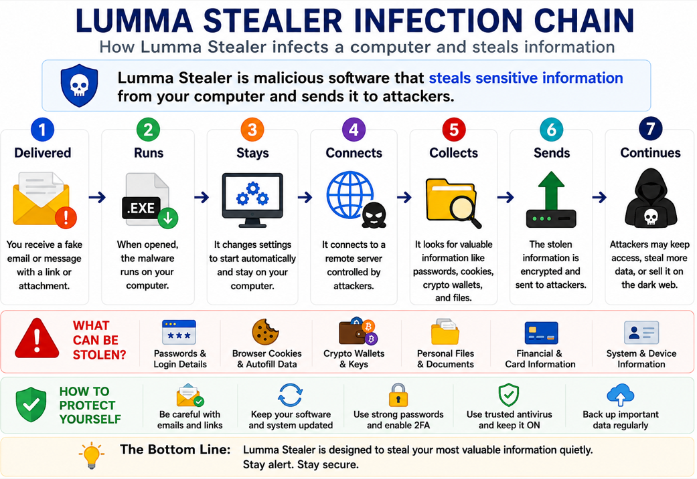

Explanation:

Shows the typical path from opening a malicious file to attempted data theft. This is an explanatory diagram, not a malware sample.
