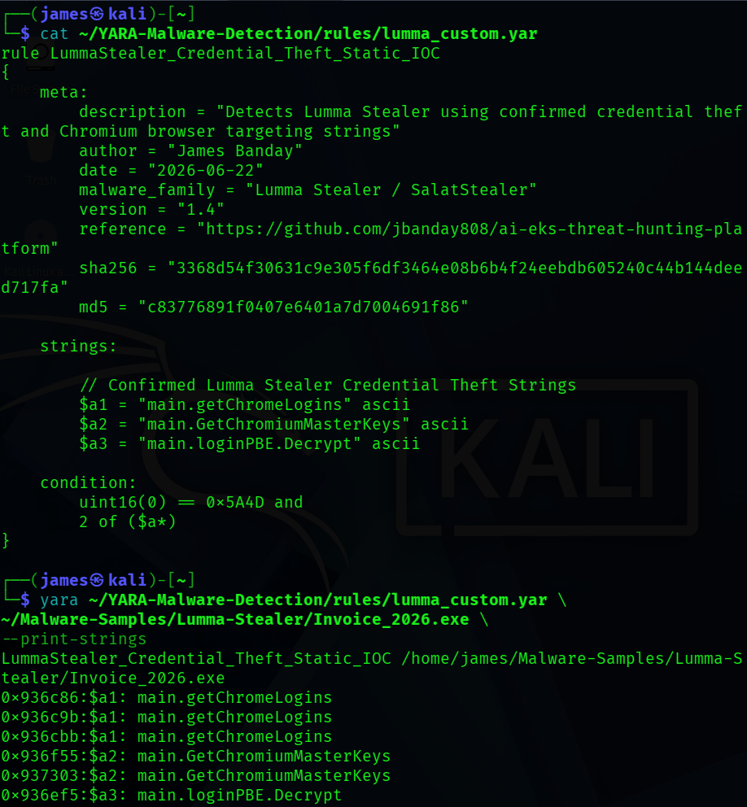

# Screenshot Evidence

## Supplemental Infection Chain Diagram
<<<<<<< HEAD

Explanation:

Shows the typical path from opening a malicious file to attempted data theft. This is an explanatory diagram, not a malware sample.

## LummaStealer_01_MalwareBazaar_Sample_Details.png

Explanation:

Shows the MalwareBazaar entry for the Lumma Stealer sample, including its hash, malware family, and vendor detections.

## LummaStealer_02_Noriben_Dynamic_Analysis_Results.png

Explanation:

Shows activity captured during malware execution, including process, file, and network-related behavior.

## LummaStealer_03_IDA_Imports.png

Explanation:

Shows the imported functions and libraries reviewed during reverse engineering.

## LummaStealer_04_IDA_PE_Overview.png

Explanation:

Shows the file overview in IDA Pro, confirming the sample is a Windows executable.

## LummaStealer_05_IDA_Credential_Theft_Indicators.png

Explanation:

Shows password-related strings that suggest the malware is designed to steal credentials.

## LummaStealer_06_IDA_Credential_Collection_Functions.png

Explanation:

Shows functions related to collecting and decrypting protected browser password data.

## LummaStealer_07_IDA_Privilege_Escalation_and_Credential_Theft_Functions.png

Explanation:

Shows functions related to privilege access, process discovery, and credential theft behavior.

## LummaStealer_08_IDA_ChromiumMasterKeys_Function_Reference.png

Explanation:

Shows a function related to Chromium browser master keys, which are used to protect saved browser passwords.

## LummaStealer_09_Defender_Threat_Classification.png

Explanation:

Shows Microsoft Defender identifying the malware as SalatStealer/Lumma Stealer.

## LummaStealer_10_ProcessMonitor_Execution_Activity.png

Explanation:

Shows Process Monitor confirming that the malware process started, created threads, and exited.

## LummaStealer_11_Defender_Threat_Blocked.png

Explanation:

Shows Microsoft Defender blocking and quarantining the malware before it could continue running.

## LummaStealer_12_Defender_Threat_Removed.png

Explanation:

Shows Microsoft Defender removing the malware from the system after quarantine.

## LummaStealer_13_YARA_Detection_Validation.png

Explanation:

This screenshot will show that the custom YARA rule successfully detected the Lumma Stealer sample based on known credential theft strings.

Status: Pending. The malware sample and YARA command-line tool are not present in this workspace, so a genuine validation screenshot could not be captured.

=======

### Overview

This diagram shows how a Lumma Stealer infection can progress from a malicious file to attempted information theft.

### Simple Summary

A malicious file is opened, the malware runs, collects information, and attempts to send the stolen data to attackers.

## LummaStealer_01_MalwareBazaar_Sample_Details.png

### Overview

Shows the threat intelligence record used to identify and research the malware sample.

### Simple Summary

This screenshot confirms the file was identified as Lumma Stealer and provides important details used during the investigation.

## LummaStealer_02_Noriben_Dynamic_Analysis_Results.png

### Overview

Shows activity recorded while the malware executed in a controlled environment.

### Simple Summary

This screenshot captures what the malware attempted to do after it was launched.

## LummaStealer_03_IDA_Imports.png

### Overview

Shows imported functions and libraries identified during reverse engineering.

### Simple Summary

This screenshot helps analysts understand which Windows features and capabilities the malware may use.

## LummaStealer_04_IDA_PE_Overview.png

### Overview

Shows the file structure and metadata of the malware sample.

### Simple Summary

This screenshot confirms the sample is a Windows executable file and provides basic file information.

## LummaStealer_05_IDA_Credential_Theft_Indicators.png

### Overview

Shows password-related strings identified during static analysis.

### Simple Summary

These indicators suggest the malware was designed to search for and collect stored credentials.

## LummaStealer_06_IDA_Credential_Collection_Functions.png

### Overview

Shows browser credential collection functionality identified during reverse engineering.

### Simple Summary

This screenshot demonstrates how the malware targets saved browser login information.

## LummaStealer_07_IDA_Privilege_Escalation_and_Credential_Theft_Functions.png

### Overview

Shows functions associated with elevated access and credential-related activity.

### Simple Summary

The malware contains functionality that may help it access sensitive information stored on the system.

## LummaStealer_08_IDA_ChromiumMasterKeys_Function_Reference.png

### Overview

Shows references associated with Chromium browser credential protection mechanisms.

### Simple Summary

This screenshot demonstrates how the malware may interact with browser-protected login information.

## LummaStealer_09_Defender_Threat_Classification.png

### Overview

Shows Microsoft Defender identifying the malware during analysis.

### Simple Summary

This screenshot confirms that Microsoft Defender recognized the file as malicious.

## LummaStealer_10_ProcessMonitor_Execution_Activity.png

### Overview

Shows the malware process being monitored during execution.

### Simple Summary

This screenshot confirms that the malware started, created activity, and eventually exited.

## LummaStealer_11_Defender_Threat_Blocked.png

### Overview

Shows Microsoft Defender blocking and quarantining the malware.

### Simple Summary

The security controls successfully prevented the malware from continuing execution.

## LummaStealer_12_Defender_Threat_Removed.png

### Overview

Shows Microsoft Defender removing the malware after detection.

### Simple Summary

The malware was successfully removed from the analysis environment.

## LummaStealer_13_YARA_Detection_Validation.png

### Overview

Shows successful validation of a custom YARA rule created during the investigation.

The rule was developed using indicators identified through malware analysis and reverse engineering and successfully detected the Lumma Stealer sample.

### Investigation Value

* Reverse Engineering
* Malware Analysis
* Detection Engineering
* YARA Rule Development
* Detection Validation

### Simple Summary

This screenshot confirms that the custom YARA rule successfully detected the Lumma Stealer sample using indicators discovered during the investigation.
>>>>>>> 749ec46 (Update Lumma Stealer screenshot documentation and YARA validation)
