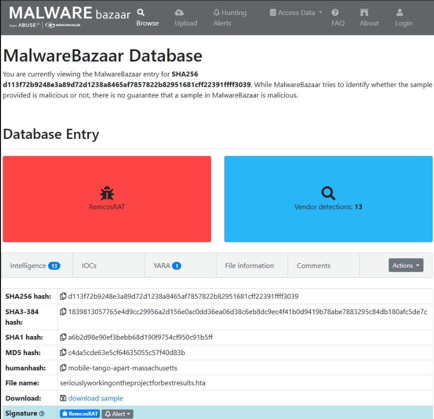
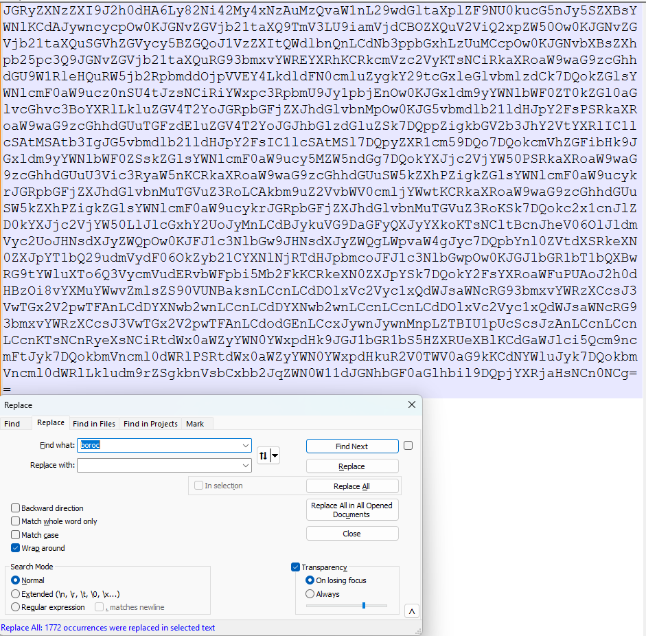
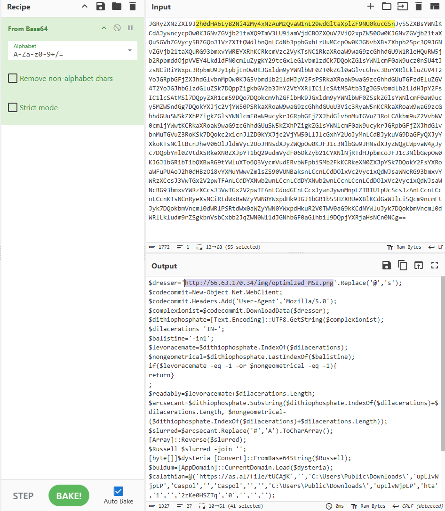
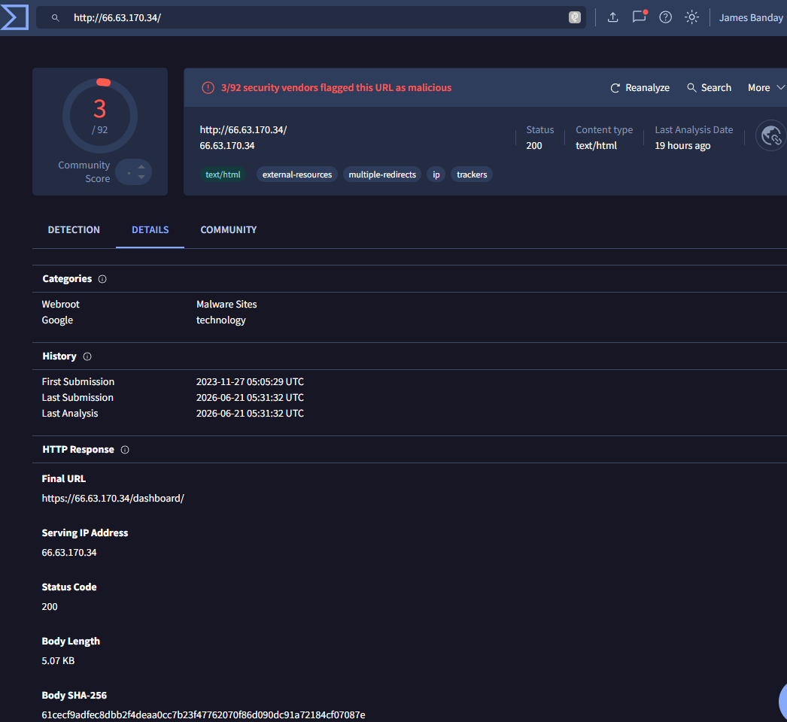
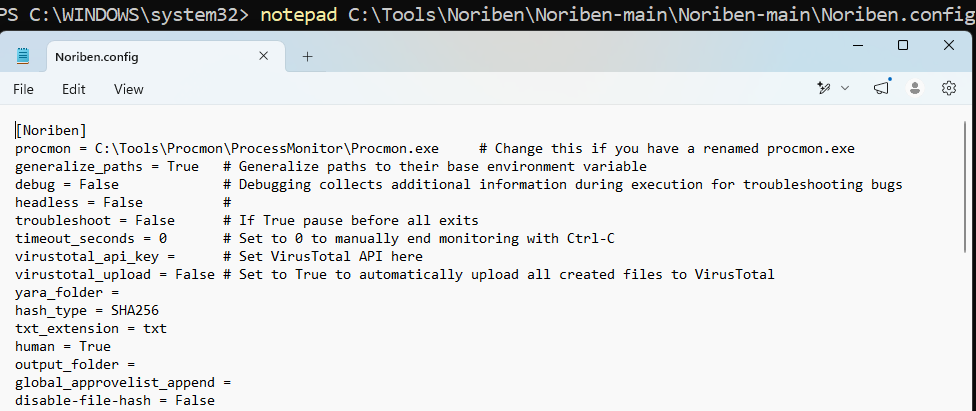
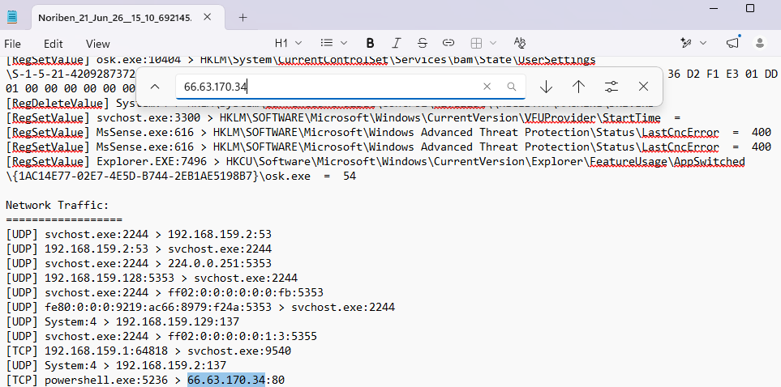
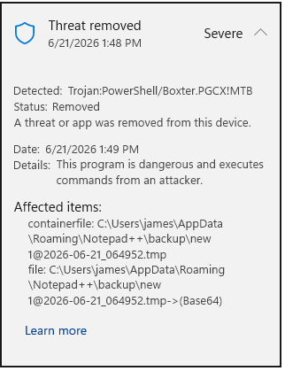

# RemcosRAT HTA and CyberChef Analysis

## Overview

This case study documents a defensive review of an obfuscated RemcosRAT-related HTML Application (`shell.hta`). The investigation used CyberChef, MalwareBazaar, VirusTotal, Noriben, and Microsoft Defender to explain the concealed loader, validate its network activity, and confirm the final remediation outcome.

Related case study: [Remcos RAT Threat Intelligence and Detection Engineering](../remcos/README.md)

## Executive Summary

The HTA contained intentionally scrambled PowerShell and Base64-encoded content. Defensive decoding showed a chain designed to retrieve data and load .NET code directly into memory. Noriben recorded PowerShell connecting to `66.63.170.34:80`, and Microsoft Defender detected and remediated the threat.

Follow-up checks found no active RemcosRAT process, no Caspol process, and no persistence on the virtual machine.

| Business question | Finding |
| --- | --- |
| What happened? | A disguised HTA used hidden PowerShell and several decoding steps in an attempted RemcosRAT loading chain. |
| Why does it matter? | The chain tried to hide its behavior and load code in memory, making basic file-only monitoring less effective. |
| What was detected? | The hidden loader, decoding behavior, network connection, and memory-loading references. |
| What was blocked? | Microsoft Defender detected and remediated the malicious PowerShell activity. |
| Final outcome | No active RemcosRAT or Caspol process was found, and no persistence was observed. |

Simple explanation: The file hid a remote-access threat behind multiple layers. Defender removed the threat, and final checks found no continuing infection.

## Key Findings

- `shell.hta` contained repeated `boroc` text intended to make the script difficult to read.
- CyberChef safely exposed the concealed content without executing it.
- The loader referenced `optimized_MSI.png` and selected content between `IN-` and `-in1`.
- It replaced `#` with `A`, reversed the string, and decoded the result from Base64.
- The decoded content referenced `AppDomain.CurrentDomain.Load` and `Fiber.Program.Main`, indicating direct .NET loading in memory.
- Noriben recorded PowerShell connecting to `66.63.170.34` over HTTP port `80`.
- Microsoft Defender detected and remediated the malicious activity.
- Verification found no active RemcosRAT or Caspol process and no persistence.

Simple explanation: The investigation translated concealed script behavior into clear evidence that security teams can detect, investigate, and explain.

## Tools Used

| Tool | Purpose |
| --- | --- |
| MalwareBazaar | Validate the malware-family classification and sample details. |
| CyberChef | Decode concealed text for defensive review without executing it. |
| VirusTotal | Add reputation context for the observed network infrastructure. |
| Noriben | Record process, file, registry, and network behavior in the isolated lab. |
| Microsoft Defender | Detect, block, and remediate the malicious activity. |
| MITRE ATT&CK | Map the findings to standard adversary techniques. |

## Reports

| Report | Scope |
| --- | --- |
| [Incident Report](reports/incident-report.md) | What happened, why it mattered, response actions, and final outcome. |
| [Static Analysis](reports/static-analysis.md) | Safe review of the obfuscation, decoding chain, and memory-loading references. |
| [Dynamic Analysis](reports/dynamic-analysis.md) | Noriben network evidence, Defender remediation, and verification results. |
| [MITRE ATT&CK Mapping](reports/mitre-attack.md) | Techniques associated with the observed HTA loading chain. |
| [Indicators of Compromise](iocs/remcos-hta-iocs.csv) | File, hash, domain, and IP indicators for defensive hunting. |

## Supporting Evidence

### Figure 1: MalwareBazaar Sample Details

**Explanation:**

MalwareBazaar identified the investigated file as RemcosRAT and provided threat intelligence information such as file hashes and vendor detections. This helped validate that the sample belonged to a known remote access trojan family before deeper analysis began.

---

### Figure 2: Boroc Obfuscation Removed

**Explanation:**

The HTA file contained intentionally scrambled text designed to hide its true purpose. By removing repeated "boroc" text, the hidden content became easier to read and analyze. This is a common technique used by malware authors to avoid detection.

---

### Figure 3: CyberChef Base64 Decode

**Explanation:**

CyberChef was used to safely decode concealed text without executing the malware. The decoded content revealed a PowerShell loader that downloaded data, performed multiple decoding steps, and attempted to load program code directly into memory.

---

### Figure 4: VirusTotal IP Reputation Analysis

**Explanation:**

VirusTotal showed that several security vendors had already flagged the IP address as suspicious or malicious. This provided additional confidence that the infrastructure contacted by the malware was associated with malicious activity.

---

### Figure 5: Noriben Configuration Verification

**Explanation:**

Noriben was configured to collect process, file, registry, and network activity during controlled malware analysis. Verifying the configuration ensured that system behavior would be properly recorded for investigation.

---

### Figure 6: Network Connection to 66.63.170.34

**Explanation:**

Noriben recorded PowerShell establishing a network connection to IP address 66.63.170.34 over port 80. This finding confirmed that the loader attempted to communicate with an external system during execution.

---

### Figure 7: Microsoft Defender Remediation

**Explanation:**

Microsoft Defender detected the malicious PowerShell activity and automatically removed the threat. Follow-up verification found no active RemcosRAT processes, no Caspol processes, and no evidence of persistence remaining on the system.

---

### Executive Summary

**Simple Summary:**

The investigation revealed a heavily obfuscated HTA-based RemcosRAT loader that attempted to download and load malicious code into memory. Microsoft Defender successfully detected and remediated the threat, and post-analysis validation confirmed no active infection or persistence remained on the virtual machine.

## Safety Notice

- Defensive cybersecurity research only.
- No malware samples included.
- No credentials included.
- No sensitive data included.
- No malware execution instructions included.

---

## Author

**James Banday**

Threat Hunter | Cyber Intrusion Analyst | Cloud Security | Kubernetes | DevSecOps | Incident Response

This case study demonstrates practical malware analysis, threat hunting, IOC enrichment, Microsoft Defender investigation, Microsoft Sentinel threat intelligence, Splunk dashboard development, detection engineering, and incident response documentation used to investigate and document RemcosRAT activity in a controlled laboratory environment.

---

## GitHub Repository

https://github.com/jbanday808/ai-powered-threat-detection-platform

---

## LinkedIn Profile

https://www.linkedin.com/in/james-allen-morta-banday-62a391128/

---

## Skills Demonstrated

- Malware Analysis
- Static Analysis
- Dynamic Analysis
- Cyber Threat Intelligence
- Incident Response
- Threat Hunting
- IOC Development
- MITRE ATT&CK Mapping
- Microsoft Defender Investigation
- Microsoft Sentinel Threat Intelligence
- Splunk Detection Engineering
- Network Traffic Analysis
- PowerShell Analysis
- CyberChef Analysis
- Noriben Analysis
- Security Reporting

---

## Project Outcome

The investigation successfully identified and documented an obfuscated RemcosRAT HTA loader that used multiple layers of concealment, PowerShell execution, network communication, and in-memory code loading techniques. Microsoft Defender detected and remediated the malicious activity, and post-analysis validation confirmed no active RemcosRAT processes, no Caspol processes, and no persistence mechanisms remained on the virtual machine.

**Final Status:** Closed
