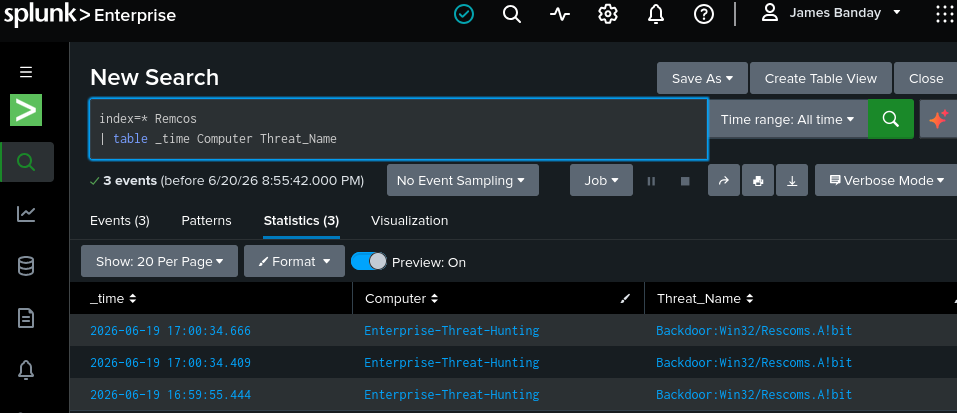
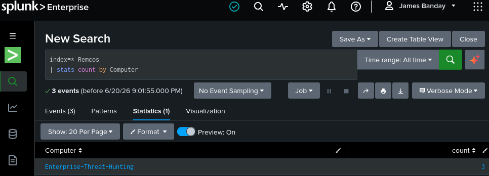
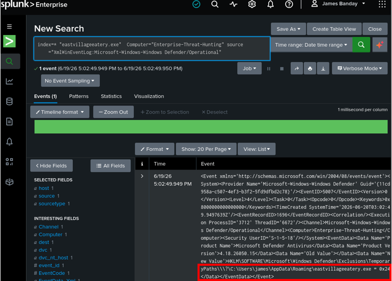
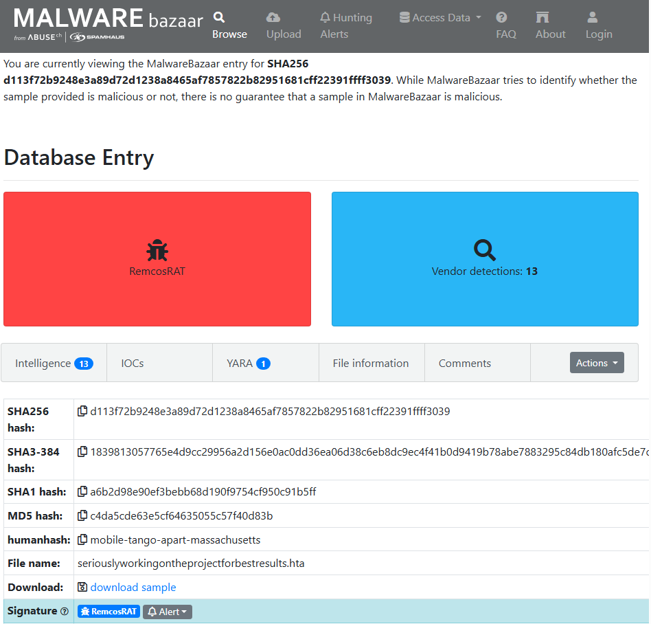
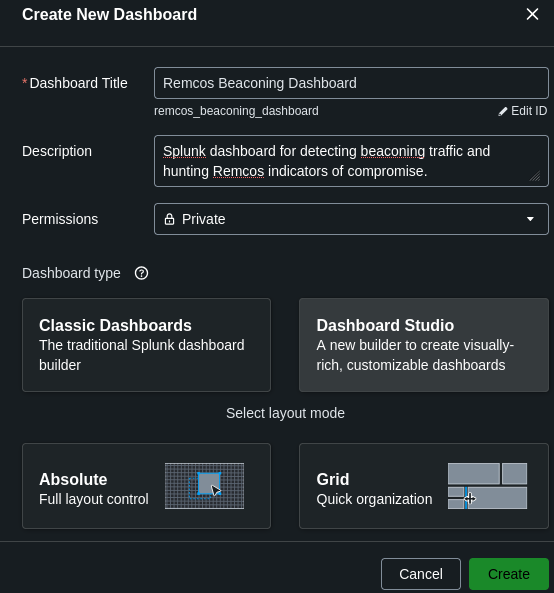
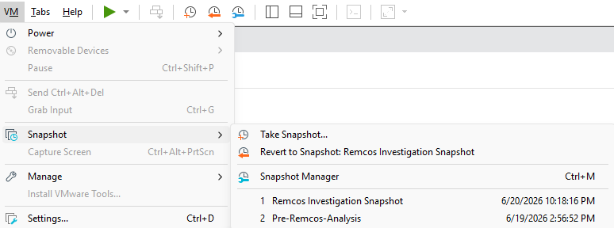
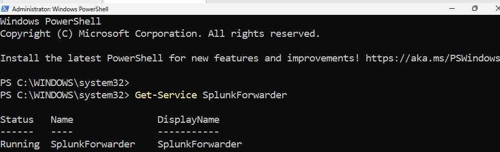
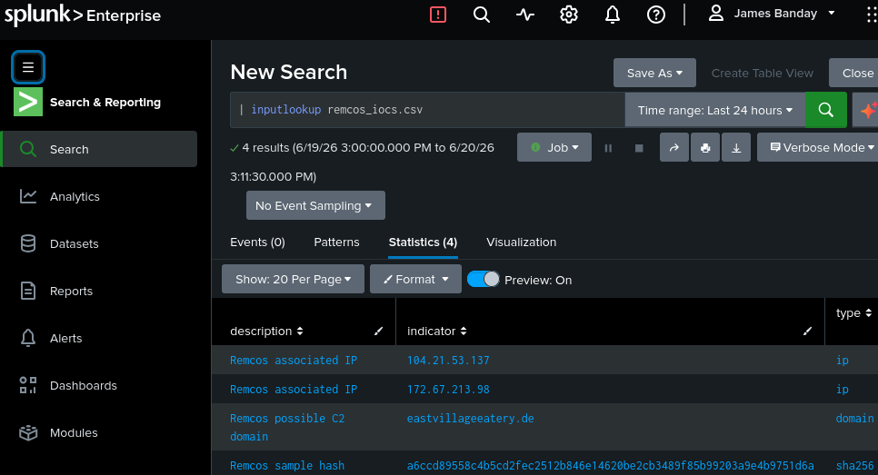
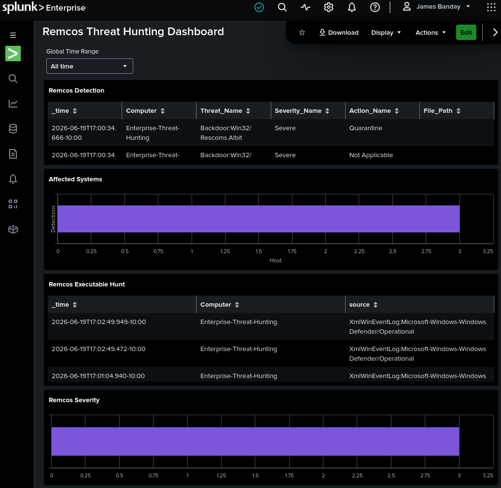

# Remcos Threat Hunting Dashboard

## Overview

This report documents a completed Splunk threat hunt for Remcos remote access trojan (RAT) activity in a Windows lab. Microsoft Defender events, known indicators of compromise (IOCs), and external threat intelligence were reviewed to confirm the threat and identify the affected system.

The results were organized into a Splunk dashboard so analysts can review detections, affected hosts, suspicious executable activity, and severity in one place. This improves visibility and supports faster defensive investigation and response.

## Objective

- Confirm Remcos-related security activity.
- Identify the affected Windows system.
- Search for activity involving the suspicious executable.
- Validate known file, domain, and IP indicators.
- Present the findings in a reusable Splunk dashboard.

## Tools Used

| Tool | Purpose |
| --- | --- |
| Splunk Enterprise | Searched, correlated, and visualized the investigation data. |
| Microsoft Defender Antivirus | Provided endpoint detections, severity, response actions, and file evidence. |
| Splunk Universal Forwarder | Sent Windows event data from the monitored host to Splunk. |
| MalwareBazaar | Provided malware-family and sample intelligence used for validation. |
| VirusTotal | Provided file, domain, IP, and vendor detection context. |
| Microsoft Sentinel Threat Intelligence | Stored and enriched the validated Remcos indicators. |
| VMware Workstation | Provided an isolated and recoverable Windows analysis environment. |
| CSV IOC lookup | Made validated indicators available for repeatable Splunk searches. |
| MITRE ATT&CK | Connected the findings to common adversary behavior and defensive use cases. |

## IOC Lookup

IOCs act like fingerprints that analysts can compare with security logs to find related malicious activity. The lookup made the validated Remcos indicators available for consistent searching and correlation in Splunk.

```spl
| inputlookup remcos_iocs.csv
```

| description | indicator | type |
| --- | --- | --- |
| Remcos associated IP | 104.21.53.137 | ip |
| Remcos associated IP | 172.67.213.98 | ip |
| Remcos possible C2 domain | eastvillageeatery.de | domain |
| Remcos sample hash | a6ccd89558c4b5cd2fec2512b846e14620be2cb3489f85b99203a9e4b9751d6a | sha256 |

## Dashboard Panels

### Remcos Detection

```spl
index=* Remcos
| table _time Computer Threat_Name
```

Shows when Remcos was detected, which system was affected, and the Microsoft Defender threat name used during triage.

### Affected Systems

```spl
index=* Remcos
| stats count by Computer
```

Groups detections by host to define the observed incident scope and identify systems requiring review.

### Remcos Executable Hunt

```spl
index=* "eastvillageeatery.exe" Computer="Enterprise-Threat-Hunting" source="XmlWinEventLog:Microsoft-Windows-Windows Defender/Operational"
```

Searches Defender operational logs for the suspicious executable and confirms its connection to the affected host.

### Remcos Severity

```spl
index=* Remcos
| stats count by Severity_Name
```

Groups detections by severity so analysts can prioritize the highest-risk activity.

## Key Findings

| Finding | Result | Why It Matters |
| --- | --- | --- |
| Malware Family | Remcos RAT | Confirms the investigation involved malware capable of unauthorized remote access. |
| Affected Host | `Enterprise-Threat-Hunting` | Identifies the system requiring containment validation and further review. |
| Threat Name | `Backdoor:Win32/Rescoms.A!bit` | Shows Microsoft Defender classified the activity as a backdoor threat. |
| Severity | `Severe` | Places the detections in the highest-priority category shown in the dashboard. |
| Suspicious File | `eastvillageeatery.exe` | Provides a specific artifact for endpoint hunting and response. |
| IOC Lookup | `eastvillageeatery.de`; `104.21.53.137`; `172.67.213.98`; `a6ccd89558c4b5cd2fec2512b846e14620be2cb3489f85b99203a9e4b9751d6a` | Supplies domain, IP, and SHA256 fingerprints for correlation across security data. |
| Threat Intelligence Reference | SHA256 `d113f72b9248e3a89d72d1238a8465af7857822b82951681cff22391ffff3039`; file `seriouslyworkingontheprojectforbestresults.hta`; 13 vendor detections | Provides independent MalwareBazaar context supporting the Remcos classification. |
| Splunk Forwarder | `Running` | Confirms the endpoint log collection service was active when verified. |

## Investigation Workflow

1. Imported Remcos IOC lookup into Splunk.
2. Verified Windows logs were reaching Splunk.
3. Reviewed Microsoft Defender detections.
4. Searched for known Remcos indicators.
5. Identified the affected system.
6. Investigated suspicious executable activity.
7. Built dashboard panels.
8. Documented evidence and findings.

This workflow moved the investigation from initial detection through validation, scoping, analysis, and clear reporting.

## Evidence

### Figure 1 — Remcos Detection Search



This search confirms three Remcos detections on the monitored system and identifies the associated threat name.

### Figure 2 — Affected Systems



This result confirms that all three detections were associated with `Enterprise-Threat-Hunting`.

### Figure 3 — Remcos Executable Hunt



This search confirms that `eastvillageeatery.exe` appeared in Defender operational data on the affected system.

### Figure 4 — MalwareBazaar Remcos RAT Record



This record classifies the reviewed sample as `RemcosRAT` and provides independent validation evidence.

### Figure 5 — Dashboard Creation



This screenshot shows the creation of a dedicated Splunk dashboard for repeatable Remcos hunting.

### Figure 6 — Investigation Snapshot



This snapshot confirms that the virtual analysis environment was preserved for safe recovery and repeat testing.

### Figure 7 — Splunk Universal Forwarder



This service check confirms that `SplunkForwarder` was running and able to support endpoint log collection.

### Figure 8 — Remcos IOC Lookup



This lookup confirms that the Remcos domain, IP addresses, and sample hash were available in Splunk.

### Figure 9 — Remcos Threat Hunting Dashboard



This dashboard brings the detections, affected host, executable activity, and severity into one investigation view.

## Analyst Summary

The dashboard confirmed Remcos-related activity on the monitored system, identified the affected host, validated suspicious executable activity, and organized the evidence into a repeatable Splunk workflow. This helped improve visibility, reduce investigation time, and support incident response.

## Conclusion

The dashboard validated the completed Remcos investigation by organizing endpoint detections, IOC data, and supporting evidence in Splunk. The same workflow can be reused for future threat hunts by updating the indicators and searches for the malware or activity under review.

## References

- [MalwareBazaar](https://bazaar.abuse.ch/)
- [VirusTotal](https://www.virustotal.com/)
- [Microsoft Defender documentation](https://learn.microsoft.com/en-us/defender-endpoint/)
- [Microsoft Sentinel Threat Intelligence documentation](https://learn.microsoft.com/en-us/azure/sentinel/understand-threat-intelligence)
- [Splunk Enterprise documentation](https://docs.splunk.com/Documentation/Splunk)
- [MITRE ATT&CK Framework](https://attack.mitre.org/)
- [VMware Workstation documentation](https://docs.vmware.com/en/VMware-Workstation-Pro/)

## Author

James Banday

Threat Hunter | Cloud Security | Kubernetes | DevSecOps | Threat Detection | Incident Response

This project demonstrates practical threat hunting, malware analysis, IOC enrichment, Splunk dashboard development, detection engineering, and incident response techniques used to investigate and document Remcos RAT activity in a controlled lab environment.

### GitHub Repository

https://github.com/jbanday808/ai-eks-threat-hunting-platform/tree/main

### LinkedIn Profile

https://www.linkedin.com/in/james-allen-morta-banday-62a391128/
