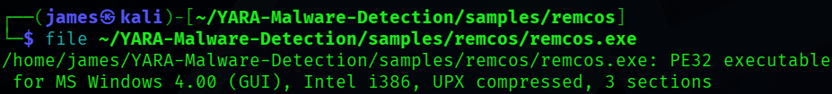
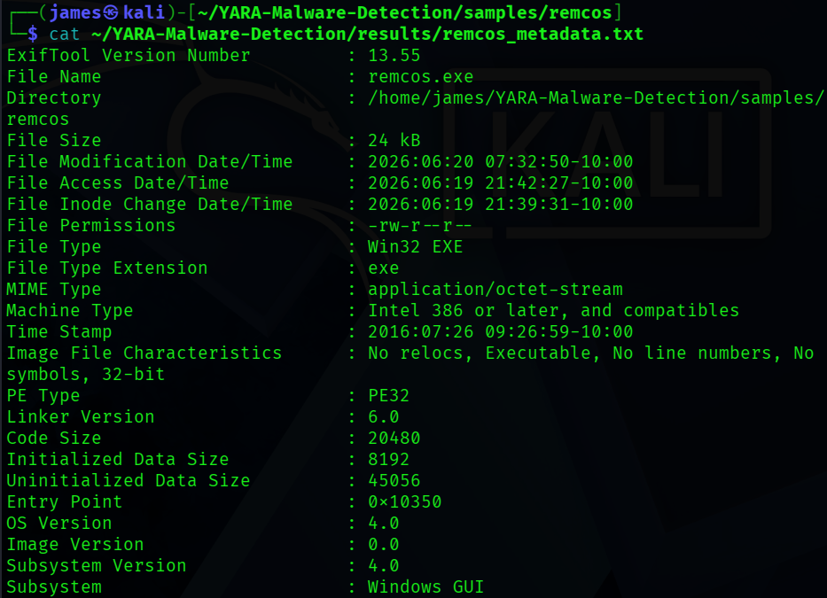
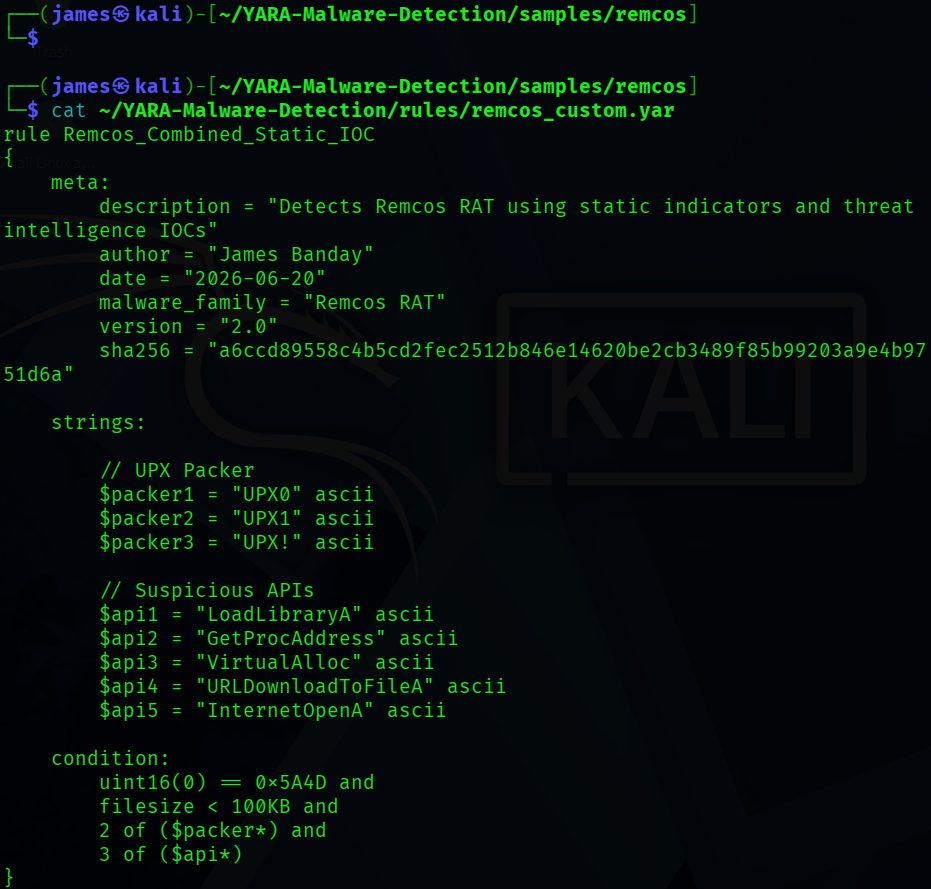
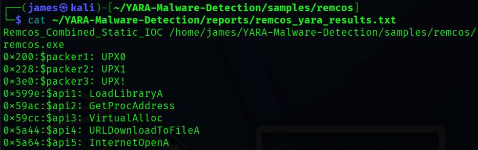

# Remcos Static Analysis Summary

## Overview

Static analysis confirmed that the Remcos sample is a UPX-packed PE32 Windows executable. The file targets 32-bit Windows systems, and its packed structure is intended to make inspection more difficult. This report documents defensive findings without running the sample.

## File Information

| Field | Value |
| --- | --- |
| SHA256 | `a6ccd89558c4b5cd2fec2512b846e14620be2cb3489f85b99203a9e4b9751d6a` |
| MD5 | `4a40b6494d80287a5660b2b0fe881ddf` |
| SHA1 | `67f28f3897dcf58f8a281ac2ee2e14cfffe1d36c` |
| File Type | PE32 Windows Executable |
| Architecture | Intel 386 / 32-bit |
| File Size | 23 KB |
| Packer | UPX 3.91 |

## Static Findings

| Indicator | Type | Defensive Significance |
| --- | --- | --- |
| `UPX0` | PE section | Common section name in a UPX-packed executable. |
| `UPX1` | PE section | Stores packed program content in a typical UPX layout. |
| `UPX!` | Packer marker | Confirms the presence of a UPX signature. |
| `LoadLibraryA` | Windows API | Can load additional libraries when the program runs. |
| `GetProcAddress` | Windows API | Can resolve functions dynamically, reducing visible imports. |
| `VirtualAlloc` | Windows API | Can allocate memory for unpacked or generated content. |
| `URLDownloadToFileA` | Windows API | Can retrieve a remote file and save it locally. |
| `InternetOpenA` | Windows API | Can initialize network access through the Windows Internet API. |

These indicators are suspicious in combination, but an individual API can also appear in legitimate software.

## YARA Detection Results

The custom YARA rule `Remcos_Combined_Static_IOC` successfully matched the sample using validated static indicators. This result provides a repeatable way for defenders to identify files with the same known characteristics.

## Threat Intelligence IOCs

| Type | Indicator |
| --- | --- |
| Domain | `eastvillageeatery.de` |
| IPv4 address | `104.21.53.137` |
| IPv4 address | `172.67.213.98` |
| Filename | `eastvillageeatery.exe` |
| Filename | `7hr8ftfxm.exe` |

These indicators should be reviewed in context because shared infrastructure and filenames can change or have unrelated uses.

## VirusTotal Findings

| Field | Result |
| --- | --- |
| Detection Ratio | 58/67 security vendors |
| Community Score | -59 |
| Tags | `peexe`, `persistence`, `spreader`, `long-sleeps`, `upx` |

The high detection ratio and negative community score support the assessment that the sample is malicious.

## Evidence Screenshots

### Figure 1: PE Executable Identification

This figure shows the sample identified as a PE32 Windows executable.

### Figure 2: File Metadata

This figure records the sample's Win32 executable metadata and static file details.

### Figure 3: Custom YARA Rule

This figure shows the `Remcos_Combined_Static_IOC` rule built from validated static indicators.

### Figure 4: YARA Match Results

This figure shows the custom YARA rule successfully matching the analyzed sample.

## Analyst Summary

The sample shows characteristics of a Remote Access Trojan, including UPX packing, suspicious API usage, and matches to known threat intelligence indicators. The static evidence and strong multi-vendor detection support classification as a Remcos-related threat. Defenders should use the listed hashes, infrastructure, filenames, and YARA logic for detection and investigation while validating each alert against local context.
