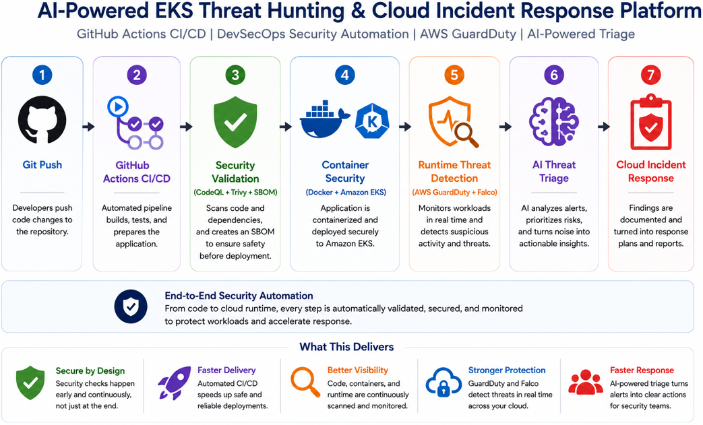
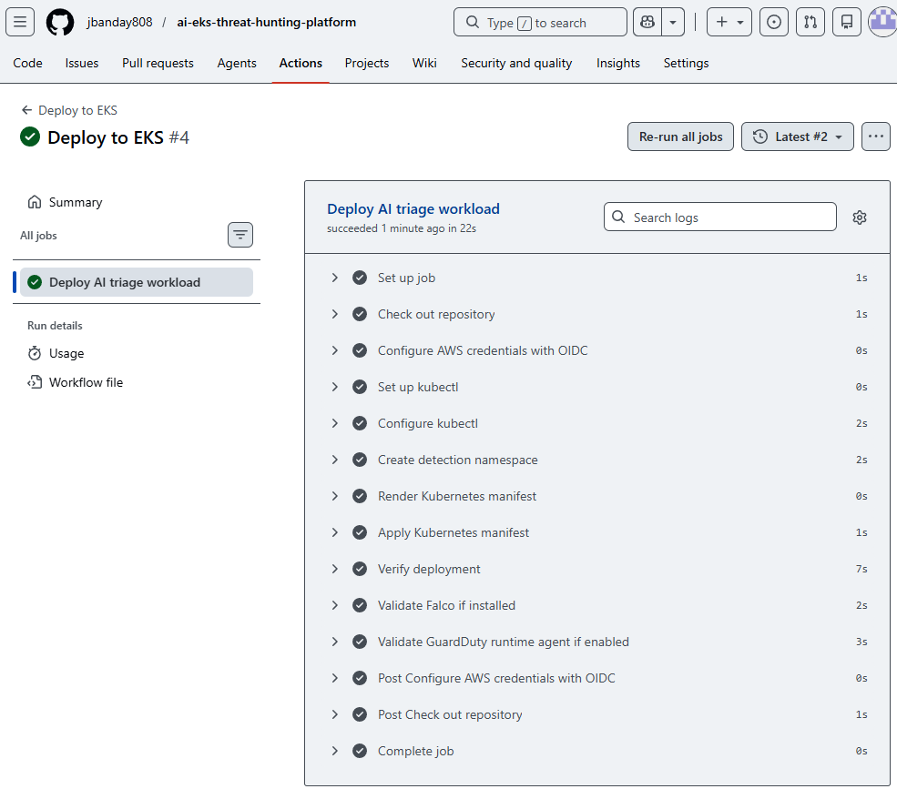
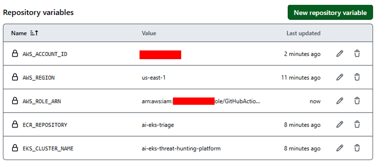
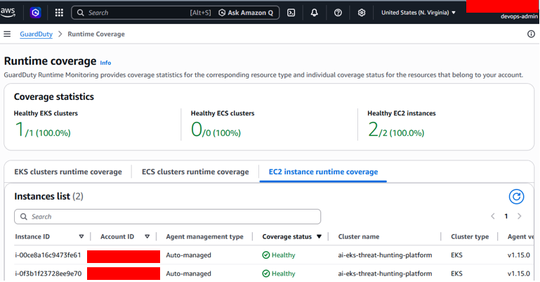
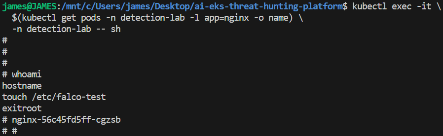
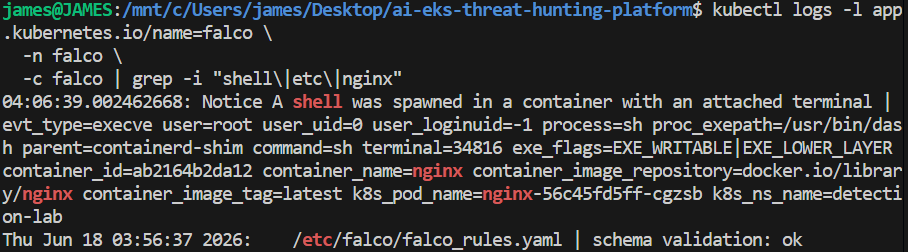
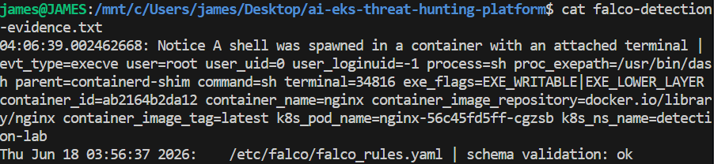
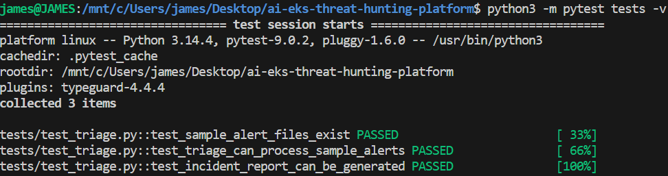

c# Architecture

The AI-Powered EKS Threat Hunting & Cloud Incident Response Platform is a DevSecOps and runtime security project for Amazon EKS. It validates infrastructure, Python code, container images, software supply chain artifacts, runtime detections, AWS-native findings, AI-assisted triage, and incident response reporting.

## Architecture Diagrams

### High-Level Architecture



Figure 1. High-level view of the AI-Powered EKS Threat Hunting & Cloud Incident Response Platform showing GitHub Actions CI/CD, security validation, container security, runtime threat detection, AI triage, and cloud incident response.

### Detailed DevSecOps Architecture


Figure 2. End-to-end DevSecOps workflow including GitHub Actions, OIDC authentication, Terraform validation, Python testing, CodeQL, Trivy, SBOM generation, Docker image build, Amazon ECR, Amazon EKS deployment, AWS Security Agent, GuardDuty runtime monitoring, AI triage, and incident response.

## Architecture Workflow

```text
Git Push
→ GitHub Actions
→ OIDC Authentication
→ Terraform Validation
→ Python Validation
→ Pytest
→ CodeQL
→ Trivy Filesystem Scan
→ SBOM Generation
→ Docker Build
→ Trivy Image Scan
→ Amazon ECR
→ Amazon EKS
→ AWS Security Agent
→ GuardDuty Runtime Monitoring
→ AI Threat Triage
→ Cloud Incident Response
```

## Technology Stack

| Technology | Purpose |
| --- | --- |
| Terraform | Builds the EKS foundation and supporting AWS infrastructure. |
| GitHub Actions | Automates CI/CD, validation, scanning, image build, and deployment. |
| GitHub OIDC | Provides short-lived AWS authentication without long-term access keys. |
| Pytest | Validates AI triage behavior with unit tests. |
| CodeQL | Performs static analysis for Python code. |
| Trivy | Scans the filesystem and container images for vulnerabilities. |
| SBOM | Documents software components in CycloneDX format. |
| Docker | Packages the AI triage workload as a container image. |
| Amazon ECR | Stores validated container images. |
| Amazon EKS | Runs Kubernetes workloads and runtime security tooling. |
| Falco | Provides open-source runtime threat detection. |
| AWS Security Agent | Supports AWS-native runtime visibility on EKS worker nodes. |
| AWS GuardDuty Runtime Monitoring | Produces AWS-native runtime security findings. |
| Python | Powers AI-assisted alert triage and incident report generation. |
| MITRE ATT&CK | Maps detections to known adversary techniques. |

## Completed Milestones

- GitHub Actions CI/CD
- GitHub OIDC Authentication
- CodeQL Static Analysis
- Trivy Security Scanning
- SBOM Generation
- Docker Build Pipeline
- Amazon ECR Integration
- Amazon EKS Deployment Pipeline
- GuardDuty Runtime Monitoring
- AWS Security Agent
- Falco Runtime Detection Validation
- AI Triage Unit Testing

## Deployment Validation Evidence

### EKS Cluster Deployment



Terraform successfully deployed the Amazon EKS cluster and worker nodes.

### Amazon ECR Repository


Amazon ECR repository used for storing container images.

### GitHub Actions Workflows


CI/CD workflows automate testing, security validation, image builds, and deployments.

### GitHub OIDC Configuration



GitHub Actions uses OIDC federation and temporary credentials instead of long-lived AWS access keys.

### GuardDuty Runtime Monitoring



AWS Security Agent and GuardDuty Runtime Monitoring are enabled and healthy on EKS worker nodes.

### Falco Runtime Detection Test







Falco successfully detected shell activity inside a Kubernetes container and generated runtime security alerts.

### AI Triage Validation




Python unit tests passed successfully and incident reports were automatically generated.

## Security Validation Results

Validated Controls:

- GitHub OIDC Authentication
- Infrastructure as Code Validation
- Python Static Validation
- Unit Testing
- CodeQL Static Analysis
- Trivy Filesystem Scanning
- SBOM Generation
- Docker Image Security Scanning
- Runtime Threat Detection
- GuardDuty Runtime Monitoring
- MITRE ATT&CK Mapping
- AI-Assisted Incident Triage
