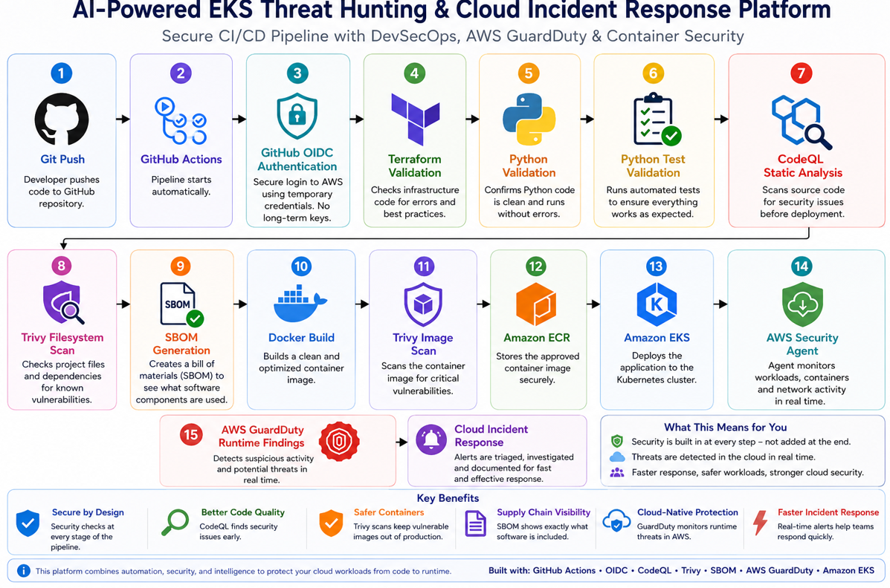

# Architecture Overview

## Project Summary

The AI-Powered EKS Threat Hunting & Incident Response Platform is a cloud security project that monitors Kubernetes workloads running on Amazon EKS. It combines infrastructure automation, runtime threat detection, alert visibility, secure access, and future AI-powered triage.


*Figure 1. High-level view of the AI-Powered EKS Threat Hunting & Cloud Incident Response Platform showing GitHub Actions CI/CD, security validation, container security, runtime threat detection, AI triage, and cloud incident response.*



*Figure 2. End-to-end DevSecOps workflow including GitHub Actions, OIDC authentication, Terraform validation, Python testing, CodeQL, Trivy, SBOM generation, Docker image build, Amazon ECR, Amazon EKS deployment, AWS Security Agent, GuardDuty runtime monitoring, AI triage, and incident response.*

### Architecture Overview

This diagram shows how the platform securely deploys cloud infrastructure, monitors Kubernetes workloads, detects suspicious activity, and supports incident response. Security events flow from the Kubernetes environment into Falco for detection, are presented through Falcosidekick for visibility, and can be processed by the AI triage engine to generate investigation-ready incident reports.

## Detection Workflow

```text
User Activity
      ↓
Amazon EKS Workload
      ↓
Falco Runtime Detection
      ↓
Falcosidekick Alert Processing
      ↓
Dashboard Visibility
      ↓
AI Alert Triage
      ↓
Incident Report Generation
      ↓
Security Investigation
```

### Simple Explanation

Think of this platform as a modern security monitoring system for cloud applications.

- Amazon EKS hosts the applications.
- Falco acts like a security camera that watches application activity.
- Falcosidekick organizes and displays alerts.
- The AI triage engine helps explain alerts and recommends response actions.
- Incident reports provide documentation that security teams can use during investigations.

It continuously watches running workloads, detects suspicious behavior, generates alerts, and helps security teams respond faster.

## Major Components

| Component | Purpose | Simple Explanation |
| --------- | ------- | ------------------ |
| Terraform | Builds and manages cloud infrastructure using code. | Terraform works like a reusable blueprint for deploying the environment. |
| Amazon S3 | Stores Terraform remote state. | S3 keeps the infrastructure state file in a central location. |
| DynamoDB | Provides Terraform state locking. | DynamoDB helps prevent two updates from changing infrastructure at the same time. |
| Amazon EKS | Runs the managed Kubernetes environment. | EKS hosts the container platform where workloads and security tools run. |
| Worker Nodes | Provide compute capacity for Kubernetes workloads. | Worker nodes are the machines that run containers. |
| Falco | Detects suspicious runtime behavior. | Falco watches application activity and creates security alerts. |
| Falcosidekick | Receives and forwards Falco alerts. | Falcosidekick organizes alerts so they can be reviewed and routed. |
| AWS Load Balancer | Provides external access to the dashboard. | The load balancer acts as the entry point for secure dashboard access. |
| Cloudflare | Manages public DNS routing. | Cloudflare connects the friendly domain name to the AWS service. |
| Route 53 | Supports AWS DNS and certificate validation. | Route 53 helps validate secure access and DNS records. |
| AI Triage Engine | Analyzes alerts and recommends response actions. | The triage engine turns raw alerts into plain-language findings. |
| Incident Reports | Document detections and response guidance. | Reports give security teams investigation-ready documentation. |

## Architecture Components

| Component | Purpose | Simple Explanation | Business Value |
| --------- | ------- | ------------------ | -------------- |
| Terraform | Builds and manages cloud infrastructure using code. | Terraform acts like a repeatable blueprint for the cloud environment. | Reduces manual setup errors and makes infrastructure easier to review, rebuild, and improve. |
| Amazon S3 | Stores Terraform remote state securely. | S3 keeps the infrastructure blueprint history in a central location. | Protects important deployment records and supports team-based infrastructure management. |
| DynamoDB | Provides Terraform state locking. | DynamoDB works like a checkout system so two people do not edit the same infrastructure state at once. | Prevents conflicting infrastructure changes and lowers operational risk. |
| Amazon EKS | Runs the managed Kubernetes control plane. | EKS provides the foundation for running containerized applications at scale. | Gives organizations a scalable and managed platform for modern applications. |
| Kubernetes Worker Nodes | Run application workloads and security tools. | Worker nodes are the machines where containers actually run. | Provides compute capacity for applications and security monitoring. |
| Falco | Monitors running containers for suspicious activity. | Falco acts like a security guard watching applications in real time. | Helps organizations identify threats quickly and reduce response time. |
| Falcosidekick | Receives and forwards Falco alerts. | Falcosidekick is the alert routing layer that helps organize security events. | Makes alerts easier to integrate with dashboards, reporting, and response workflows. |
| Falcosidekick UI | Displays Falco alerts in a web dashboard. | The UI gives security teams a place to review suspicious activity visually. | Improves visibility for analysts, managers, and stakeholders. |
| AWS Load Balancer | Exposes the Falcosidekick UI to approved external users. | The load balancer is the front door to the dashboard. | Enables reliable access while supporting secure HTTPS traffic. |
| Cloudflare | Manages public DNS for the Falcosidekick UI domain. | Cloudflare connects a friendly domain name to the AWS load balancer. | Makes access easier and supports stronger public-facing DNS controls. |
| Future AI Triage Engine | Enriches alerts and generates incident summaries. | The AI engine will help translate raw security alerts into analyst-friendly findings. | Reduces manual triage time and supports faster incident response. |

## End-to-End Workflow

```text
User Activity
  -> Kubernetes Application
  -> Falco Detection
  -> Alert Generation
  -> Dashboard Visibility
  -> Security Investigation
  -> Incident Response
```

## How the Platform Works

1. A user or process performs an action inside a Kubernetes workload.
2. Falco observes runtime behavior from the running container environment.
3. If the behavior matches a detection rule, Falco generates an alert.
4. Falcosidekick receives the alert and makes it available for review.
5. Falcosidekick UI provides dashboard visibility for investigation.
6. Security teams map the alert to MITRE ATT&CK techniques and determine response steps.
7. Future AI triage will summarize the alert, explain risk, and recommend next actions.

## Business Impact

This architecture helps organizations move from limited container visibility to active runtime monitoring. Instead of only relying on preventive controls, the platform shows how security teams can detect suspicious behavior after workloads are running.

The result is better cloud security visibility, faster investigation, and a stronger incident response foundation.
